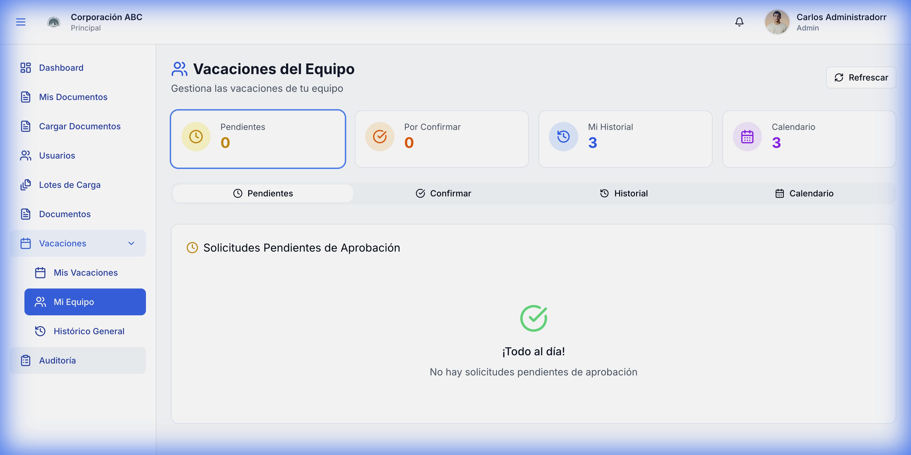
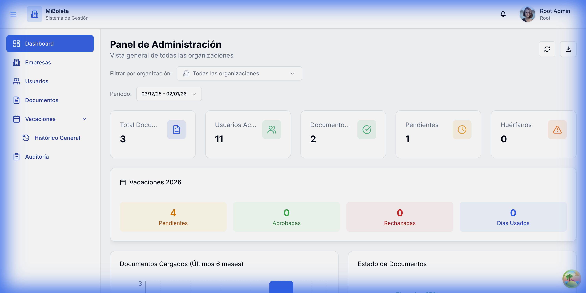
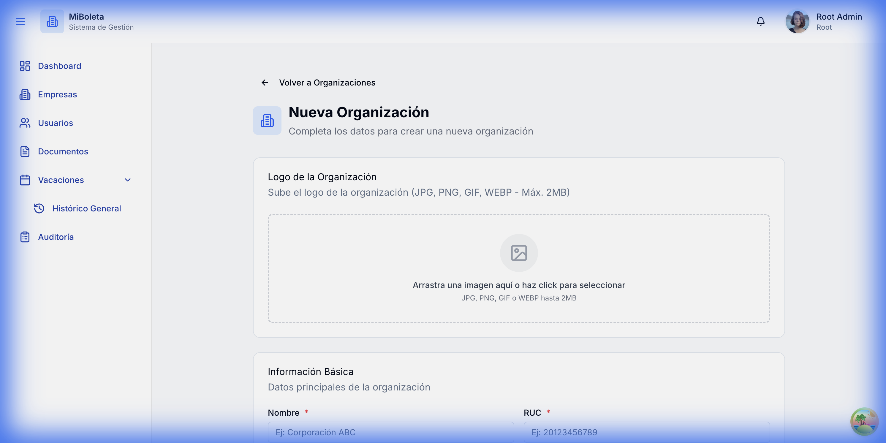
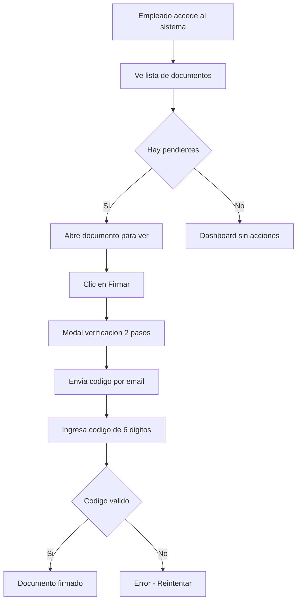
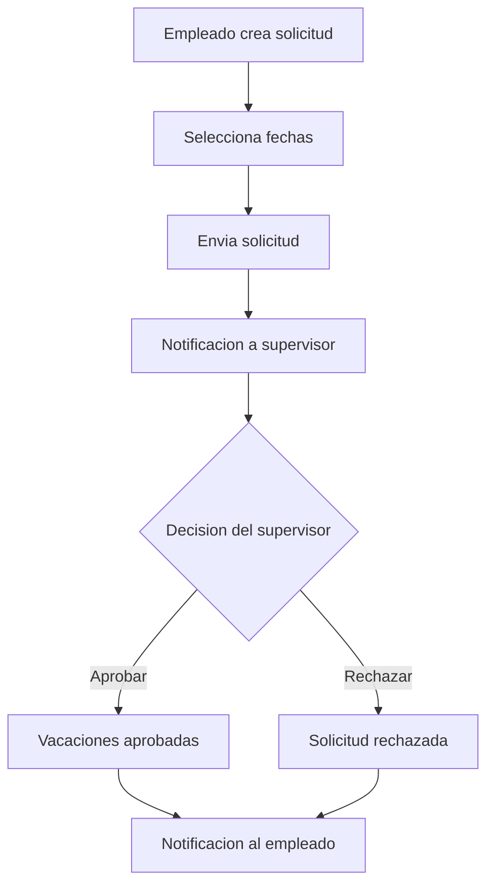
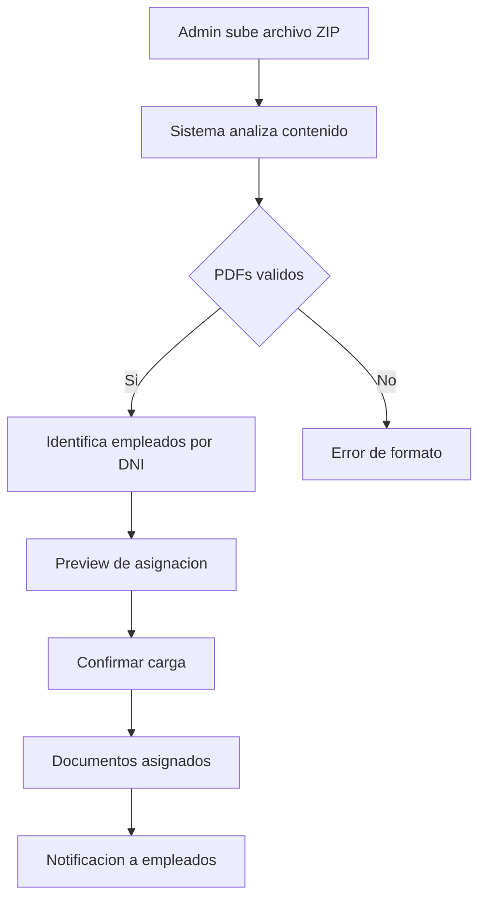
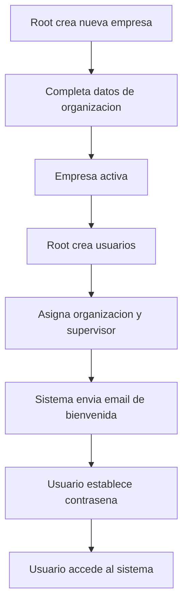

# MiBoleta - Documentación Funcional

## Información General

| Atributo | Valor |
|----------|-------|
| **Nombre del Sistema** | MiBoleta |
| **Versión** | 1.1.0 |
| **Fecha de Documentación** | Agosto 2026 |
| **Tipo** | Sistema de Gestión Documental y Vacaciones |

---

## Descripción General

**MiBoleta** es una plataforma **multi-empresa** para la gestión de documentos
laborales y de vacaciones. Una sola instalación atiende a varias empresas, con
sus datos completamente separados entre sí.

Funciones principales:

- **Distribución de documentos laborales** (boletas de pago, contratos,
  liquidaciones), individual o mediante carga masiva de un archivo ZIP.
- **Alta masiva de personal** a partir de un archivo, con validación previa y
  procesamiento en segundo plano.
- **Dos firmas independientes**: la del trabajador, con código de verificación
  por correo, y la **firma digital criptográfica PAdES** de la empresa, que da
  validez del documento frente a terceros.
- **Gestión de vacaciones** según el régimen laboral peruano, con cálculo de los
  cuatro conceptos (Pendientes, Gozadas, Truncas y Saldo) y flujo de aprobación
  y confirmación.
- **Servidor de correo propio por empresa**, con reserva al de la plataforma.
- **Notificaciones** en tiempo real dentro de la aplicación y por correo.
- **Auditoría** de las acciones del sistema.

---

## Roles del Sistema

Cinco roles. `root` pertenece a la plataforma; los otros cuatro se asignan
**por empresa**, de modo que una misma persona puede tener roles distintos en
cada una y alterna entre ellos con los selectores de la barra superior.

| Rol | Nombre en pantalla | Alcance |
|-----|--------------------|---------|
| `root` | Super Administrador | Plataforma: crea empresas, gestiona el certificado de firma y la configuración global. No opera en el día a día de ninguna empresa. |
| `admin_tenant` | Admin Clientes | Su empresa por completo, incluidos los usuarios Admin y Aprobador, y la carga masiva de personal. |
| `admin` | Admin Empleados | Operación diaria de su empresa: documentos, usuarios, vacaciones y reportes. |
| `aprobador` | Aprobador | Aprueba, rechaza y confirma las vacaciones de las personas a su cargo. |
| `client` | Empleado | Sus documentos, su firma y sus solicitudes de vacaciones. |

> `root` **no es un comodín**: solo puede lo que la matriz de accesos le concede
> explícitamente, y esta lo excluye de acciones operativas como firmar
> documentos o solicitar vacaciones.
>
> La matriz completa de permisos, generada desde la configuración del sistema,
> está en el **Manual de Usuario**, sección «Qué puede hacer cada rol».

---

## 1. Autenticación

### 1.1 Página de Inicio de Sesión


**Descripción:**
La página de login proporciona acceso seguro al sistema mediante credenciales de usuario.

**Elementos de la interfaz:**

| Elemento | Descripción |
|----------|-------------|
| **Logo MiBoleta** | Identidad visual del sistema |
| **Campo "DNI o correo electrónico"** | Admite **cualquiera de los dos** como identificador |
| **Campo Contraseña** | Entrada segura con opción mostrar/ocultar |
| **Botón "Iniciar Sesión"** | Ejecuta la autenticación |
| **Enlace "¿Olvidaste tu contraseña?"** | Inicia flujo de recuperación |
| **Pie de página** | Información legal y copyright |

**Flujo de autenticación:**
1. La persona ingresa su DNI **o** su correo, y la contraseña. Se admiten ambos
   porque muchos trabajadores no tienen correo corporativo y sí recuerdan su
   documento.
2. El sistema valida las credenciales.
3. Si son válidas, emite un **token de acceso de Laravel Sanctum** con una hora
   de vigencia, más un **token de refresco** de 30 días que permite renovar la
   sesión sin volver a pedir la contraseña.
4. Si la cuenta está marcada para cambio obligatorio de contraseña —cuenta
   recién creada o contraseña restablecida por un administrador—, se redirige a
   la pantalla de cambio y no se permite continuar hasta definir una nueva.
5. Si son inválidas, muestra un mensaje de error.

**Selección de empresa y rol.** Toda la operación ocurre dentro de una empresa.
Quien pertenece a más de una dispone de un selector de empresa en la barra
superior y, si tiene roles distintos en ellas, de un selector de rol. La
combinación determina qué se ve y qué se puede hacer; el aislamiento entre
empresas es efectivo, no un simple filtro de presentación.

---

## 2. Dashboard de Empleado (Rol: Client)

### 2.1 Vista Principal del Empleado


**Descripción:**
El dashboard del empleado presenta un resumen de sus documentos pendientes y firmados, con acceso directo a visualización y firma.

**Secciones principales:**

| Sección | Contenido |
|---------|-----------|
| **Sidebar** | Navegación: Inicio, Mis Documentos, Mis Vacaciones |
| **Encabezado** | Bienvenida personalizada con nombre del usuario |
| **Cards de Métricas** | Total documentos, Firmados, Pendientes |
| **Filtros** | Buscador, tipo de documento, estado |
| **Lista de Documentos** | Tarjetas con información de cada documento |

**Información por documento:**

| Campo | Descripción |
|-------|-------------|
| **Tipo** | Categoría (Contrato, Boleta, Liquidación) |
| **Período** | Mes y año correspondiente |
| **Estado** | Badge visual (Pendiente Firma / Firmado) |
| **Fecha de asignación** | Cuándo fue cargado |
| **Fecha de firma** | Cuándo fue firmado (si aplica) |
| **Acciones** | Ver documento, Firmar (si pendiente) |

---

## 3. Visor de Documentos

### 3.1 Visualización de Documento PDF


**Descripción:**
El visor de documentos permite al empleado revisar el contenido completo del documento en formato PDF antes de firmarlo.

**Componentes:**

| Componente | Función |
|------------|---------|
| **Breadcrumb** | Navegación: Inicio > Documento |
| **Área de visualización** | Renderizado del PDF embebido |
| **Información del documento** | Tipo, período, fecha de carga |
| **Estado** | Indicador visual del estado de firma |
| **Botón "Firmar Documento"** | Inicia el proceso de firma (visible solo si pendiente) |
| **Botón "Descargar"** | Obtiene copia del documento |
| **Botón "Volver"** | Regresa al dashboard |

---

## 4. Proceso de Firma Digital

### 4.1 Modal de Verificación en Dos Pasos (Paso 1)


**Descripción:**
El primer paso del proceso de firma solicita al usuario confirmar que desea firmar y envía un código de verificación a su correo electrónico.

**Contenido del modal:**

| Elemento | Descripción |
|----------|-------------|
| **Título** | "Verificación en Dos Pasos" |
| **Documento a firmar** | Nombre y período del documento |
| **Descripción** | Explicación del proceso |
| **Botón "Enviar Código"** | Dispara el envío del código al email |
| **Botón cancelar** | Cierra el modal sin firmar |

**Flujo:**
1. Usuario hace clic en "Firmar Documento"
2. Aparece modal de verificación
3. Usuario confirma enviando código
4. Sistema envía código de 6 dígitos al email registrado

### 4.2 Modal de Ingreso de Código (Paso 2)


**Descripción:**
El segundo paso solicita al usuario ingresar el código de 6 dígitos recibido por correo electrónico.

**Contenido del modal:**

| Elemento | Descripción |
|----------|-------------|
| **Título** | "Ingresa el Código" |
| **Campo de código** | 6 inputs numéricos independientes |
| **Email parcial** | Muestra email oculto parcialmente |
| **Temporizador** | Tiempo restante (5 minutos) |
| **Botón "Nuevo Código"** | Solicita reenvío del código |
| **Botón "Verificar y Firmar"** | Completa el proceso de firma |

**Flujo:**
1. Usuario recibe código por email
2. Ingresa los 6 dígitos en el formulario
3. Sistema valida el código
4. Si es válido: documento queda firmado con timestamp
5. Si es inválido: muestra error y permite reintentar

---

## 5. Gestión de Vacaciones (Empleado)

### 5.0 Cómo se calculan las vacaciones

El sistema aplica el régimen laboral peruano (D.Leg. 713 y régimen MYPE) y
expone **cuatro cifras**, que son las que el cliente maneja:

| Concepto | Qué es |
|----------|--------|
| **Vacaciones Pendientes** | Días de los años de servicio ya cumplidos. Incluye los que ya se tomaron, así que puede ser mayor que el Saldo. |
| **Vacaciones Gozadas** | Días ya aprobados o confirmados como tomados. |
| **Vacaciones Truncas** | Devengo proporcional del año laboral en curso, por dozavos y treintavos (D.S. 012-92-TR, art. 22). |
| **Saldo de Vacaciones** | `Pendientes + Truncas − Gozadas`. Es el tope contra el que se valida una solicitud. |

Dos reglas que condicionan todo el módulo:

- **El devengo depende del régimen de cada empresa**: 30 días al año en régimen
  general, 15 en régimen MYPE (micro y pequeña empresa).
- **La antigüedad se cuenta por empresa**, no por persona. La fecha de ingreso
  vive en el vínculo entre el trabajador y la empresa, de modo que quien trabaja
  en dos empresas tiene dos antigüedades y dos saldos independientes.

### 5.1 Lista de Mis Vacaciones


**Descripción:**
Vista que permite al empleado consultar el estado de sus solicitudes de vacaciones y crear nuevas solicitudes.

**Componentes:**

| Componente | Función |
|------------|---------|
| **Encabezado** | Título y botón "Nueva Solicitud" |
| **Cards de métricas** | Total, Pendientes, Aprobadas |
| **Filtro de estado** | Dropdown para filtrar solicitudes |
| **Lista de solicitudes** | Tarjetas con detalle de cada solicitud |

**Información por solicitud:**

| Campo | Descripción |
|-------|-------------|
| **Estado** | Badge (Pendiente, Aprobada, Rechazada) |
| **Fechas** | Rango de inicio a fin |
| **Duración** | Días totales |
| **Fecha de solicitud** | Cuándo fue creada |
| **Fecha de aprobación** | Cuándo fue procesada |
| **Motivo** | Razón opcional |

### 5.2 Formulario de Nueva Solicitud


**Descripción:**
Formulario para crear una nueva solicitud de vacaciones.

**Campos del formulario:**

| Campo | Tipo | Requerido | Descripción |
|-------|------|-----------|-------------|
| **Rango de Fechas** | Date picker | Sí | Fecha inicio y fin |
| **Motivo** | Textarea | No | Razón de la solicitud (máx 1000 caracteres) |

**Panel informativo "¿Cómo funciona?":**
1. Envío de la solicitud al sistema
2. Notificación automática al supervisor
3. Revisión y decisión del supervisor
4. Notificación por email del resultado

---

## 6. Panel de Administrador

### 6.1 Dashboard de Administrador


**Descripción:**
Vista principal del administrador con métricas globales de la organización.

**Secciones del sidebar:**

| Sección | Función |
|---------|---------|
| **Dashboard** | Vista principal |
| **Cargar Documentos** | Carga masiva ZIP |
| **Usuarios** | Gestión de empleados |
| **Lotes de Carga** | Historial de cargas |
| **Documentos** | Buscador de documentos |
| **Auditoría** | Registro de actividad |
| **Mi Equipo** | Vacaciones de subordinados |
| **Histórico General** | Todas las vacaciones |

**Métricas principales:**

| Métrica | Descripción |
|---------|-------------|
| **Total Documentos** | Cantidad total cargados |
| **Usuarios Activos** | Empleados en la organización |
| **Documentos Firmados** | Porcentaje de cumplimiento |
| **Pendientes** | Documentos sin firmar |
| **Huérfanos** | Documentos sin usuario asignado |

**Gráficos:**
- **Documentos Cargados:** Barras por mes (últimos 6 meses)
- **Estado de Documentos:** Gráfico circular (firmados vs pendientes)

**Panel de Vacaciones:**
- Solicitudes pendientes, aprobadas, rechazadas
- Días consumidos por la organización

---

## 7. Carga Masiva de Documentos

### 7.1 Interfaz de Carga


**Descripción:**
Permite al administrador cargar múltiples documentos simultáneamente mediante un archivo ZIP.

**Flujo de carga:**

**Paso 1 - Seleccionar Archivo ZIP:**
- Zona de drag-and-drop
- Requisito: archivo ZIP conteniendo PDFs
- Los PDFs deben estar nombrados con el DNI del empleado

**Paso 2 - Resultado del Análisis:**
- Preview de documentos encontrados
- Identificación automática de empleados por DNI
- Alertas de documentos sin coincidencia

**Estructura esperada del ZIP:**
```
carga_documentos.zip
├── 12345678.pdf    → Empleado con DNI 12345678
├── 87654321.pdf    → Empleado con DNI 87654321
└── 55667788.pdf    → Empleado con DNI 55667788
```

---

## 8. Gestión de Usuarios

### 8.1 Lista de Usuarios


**Descripción:**
Permite visualizar, buscar y gestionar los usuarios de la organización.

**Filtros disponibles:**

| Filtro | Función |
|--------|---------|
| **Buscador** | Por nombre, email o DNI |
| **Organización** | Filtrar por tenant |
| **Estado** | Activo / Inactivo |
| **Exportar** | Descargar lista en Excel |

**Columnas de la tabla:**

| Columna | Contenido |
|---------|-----------|
| **Nombre** | Nombre completo + email |
| **Documento** | DNI del empleado |
| **Rol** | Badge de rol (admin, client) |
| **Tenants** | Organización asignada |
| **Supervisor** | Supervisor directo |
| **Estado** | Badge de estado |
| **Acciones** | Ver perfil |

---

## 9. Buscador de Documentos

### 9.1 Lista de Documentos


**Descripción:**
Permite al administrador buscar y gestionar todos los documentos de la organización.

**Filtros disponibles:**

| Filtro | Función |
|--------|---------|
| **Rango de fechas** | Fecha de carga |
| **Tipo de documento** | Categoría |
| **Estado** | Firmado / Pendiente |
| **Buscar usuario** | Por nombre o DNI |

**Columnas de la tabla:**

| Columna | Contenido |
|---------|-----------|
| **Apellido/Nombre** | Empleado asignado + DNI |
| **Tipo/Período** | Categoría y mes/año |
| **Fecha de subida** | Timestamp de carga |
| **Estado** | Badge de firma |
| **Acciones** | Ver, Eliminar |

**Funcionalidades:**
- Exportar listado
- Limpiar filtros
- Paginación configurable

---

## 10. Registro de Auditoría

### 10.1 Log de Actividad


**Descripción:**
Registro completo de todas las acciones realizadas en el sistema para cumplimiento y seguridad.

**Eventos rastreados:**

| Evento | Descripción |
|--------|-------------|
| **Inició sesión** | Login de usuario |
| **Cerró sesión** | Logout de usuario |
| **Documento firmado** | Firma completada |
| **Documento cargado** | Nueva carga de documento |
| **Usuario creado** | Alta de empleado |
| **Vacación solicitada** | Nueva solicitud |
| **Vacación aprobada/rechazada** | Decisión de supervisor |

**Columnas del log:**

| Columna | Contenido |
|---------|-----------|
| **Usuario** | Nombre + email |
| **Acción** | Tipo de evento |
| **Detalle** | Información adicional |
| **IP** | Dirección de origen |
| **Fecha** | Timestamp exacto |
| **Categoría** | Usuario / Documento / Vacaciones |

**Filtros:**
- Rango de fechas
- Categoría
- Tipo de acción
- Usuario específico

---

## 11. Gestión de Vacaciones del Equipo

### 11.1 Vacaciones del Equipo (Supervisor)



**Descripción:**
Permite al supervisor gestionar las solicitudes de vacaciones de sus subordinados directos.

**Cards de métricas:**

| Métrica | Descripción |
|---------|-------------|
| **Pendientes** | Solicitudes por aprobar |
| **Por Confirmar** | En estado intermedio |
| **Mi Historial** | Solicitudes procesadas |
| **Calendario** | Eventos de vacaciones |

**Pestañas:**

| Pestaña | Contenido |
|---------|-----------|
| **Pendientes** | Solicitudes que requieren acción |
| **Confirmar** | Solicitudes pre-aprobadas |
| **Historial** | Solicitudes ya procesadas |
| **Calendario** | Vista de calendario |

**Saldo del solicitante en la propia fila:**

Cada solicitud pendiente muestra el saldo de quien la pide **en la empresa de
esa solicitud**, con el desglose de los tres conceptos que lo componen y una
línea de conclusión:

- *«Le quedarían X días»* cuando el saldo alcanza.
- *«Excede por X días»*, resaltado, cuando lo solicitado lo supera.

Existe porque el saldo puede haber bajado entre la solicitud y la aprobación,
si entretanto se aprobaron otras vacaciones. **El aviso de exceso no bloquea la
aprobación**: informa para decidir, la decisión sigue siendo del aprobador.

**Acciones por solicitud:**
- **Aprobar:** Concede las vacaciones
- **Rechazar:** Deniega la solicitud (requiere motivo)
- **Confirmar si se tomaron:** Una vez pasadas las fechas, el aprobador indica
  si el descanso se disfrutó realmente. Solo entonces cuenta como *Gozadas*.

---

## 12. Histórico General de Vacaciones

### 12.1 Histórico Completo


**Descripción:**
Vista centralizada de todas las solicitudes de vacaciones de la organización.

**Cards de métricas:**

| Métrica | Descripción |
|---------|-------------|
| **Total Solicitudes** | Todas las solicitudes |
| **Aprobadas** | Solicitudes concedidas |
| **Tomadas** | Vacaciones ya gozadas |

**Columnas de la tabla:**

| Columna | Contenido |
|---------|-----------|
| **Empleado** | Nombre + email + iniciales |
| **Fechas** | Rango de vacaciones |
| **Días** | Cantidad de días |
| **Estado** | Badge de estado |
| **Tomada** | Si ya fue gozada |
| **Solicitado** | Fecha de creación |
| **Aprobado por** | Supervisor + fecha |

**Funcionalidades:**
- Exportar a Excel
- Filtrar por fechas, estado, empleado
- Actualizar listado

---

## 13. Panel de Root (Super Administrador)

### 13.1 Dashboard de Root



**Descripción:**
El dashboard de Root proporciona una vista global de todas las organizaciones del sistema, con acceso a funciones de administración multi-tenant.

**Diferencias con Admin:**

| Característica | Root | Admin |
|----------------|------|-------|
| **Alcance** | Todas las organizaciones | Solo su organización |
| **Crear empresas** | Sí | No |
| **Crear usuarios globales** | Sí | Solo de su empresa |
| **Filtro por organización** | Sí | No |

**Secciones del sidebar exclusivas de Root:**

| Sección | Función |
|---------|---------|
| **Empresas** | Crear y gestionar organizaciones |
| **Usuarios** | Gestión global de usuarios |
| **Documentos** | Vista global de documentos |
| **Auditoría** | Logs de todo el sistema |

**Filtro de organización:**
Root puede filtrar toda la información por organización específica o ver "Todas las organizaciones" simultáneamente.

---

## 14. Gestión de Empresas (Rol: Root)

### 14.1 Lista de Empresas


**Descripción:**
Permite al Root visualizar y gestionar todas las organizaciones registradas en el sistema.

**Cards de métricas:**

| Métrica | Descripción |
|---------|-------------|
| **Total** | Organizaciones registradas |
| **Activas** | Empresas con acceso habilitado |
| **Inactivas** | Empresas deshabilitadas |

**Columnas de la tabla:**

| Columna | Contenido |
|---------|-----------|
| **RUC** | Identificador fiscal de la empresa |
| **Razón Social** | Nombre legal de la empresa |
| **Teléfono** | Contacto de la empresa |
| **Estado** | Badge (Activo/Inactivo) |
| **Acciones** | Editar, Desactivar |

### 14.2 Formulario de Nueva Empresa



**Descripción:**
Formulario para crear una nueva organización en el sistema.

**Campos del formulario:**

| Campo | Tipo | Requerido | Descripción |
|-------|------|-----------|-------------|
| **Logo** | Imagen | No | Logo de la empresa (drag-and-drop) |
| **Nombre** | Text | Sí | Razón social de la empresa |
| **RUC** | Text | Sí | Identificador fiscal único |
| **Teléfono** | Text | No | Número de contacto |
| **Dirección** | Text | No | Dirección física |
| **Estado** | Toggle | Sí | Activo / Inactivo |

**Flujo de creación:**
1. Root accede a Empresas > "+ Organización"
2. Completa los datos requeridos
3. Opcionalmente sube logo de la empresa
4. Guarda la nueva organización
5. La empresa queda disponible para asignar usuarios

---

## 15. Gestión Global de Usuarios (Rol: Root)

### 15.1 Lista de Usuarios


**Descripción:**
Vista global de todos los usuarios del sistema, con capacidad de filtrar por organización.

**Filtros disponibles:**

| Filtro | Función |
|--------|---------|
| **Buscar** | Por nombre, email o DNI |
| **Organización** | Filtrar por empresa |
| **Rol** | Root, Admin, Usuario |
| **Estado** | Activo / Inactivo |

**Columnas de la tabla:**

| Columna | Contenido |
|---------|-----------|
| **Nombre** | Nombre completo + email |
| **Documento** | DNI del usuario |
| **Rol** | Badge de rol |
| **Tenants** | Organizaciones asignadas |
| **Supervisor** | Jefe inmediato asignado |
| **Estado** | Activo / Inactivo |
| **Acciones** | Editar, Ver |

### 15.2 Formulario de Nuevo Usuario (Parte Superior)


**Descripción:**
Sección superior del formulario para crear un nuevo usuario.

**Campos de información personal:**

| Campo | Tipo | Requerido | Descripción |
|-------|------|-----------|-------------|
| **Nombre** | Text | Sí | Nombre del usuario |
| **Apellido** | Text | Sí | Apellido del usuario |
| **Email** | Email | Sí | Correo electrónico (login) |
| **Tipo de Documento** | Select | Sí | DNI, Pasaporte, etc. |
| **Número de Documento** | Text | Sí | Número del documento |
| **Teléfono** | Text | No | Número de contacto |

### 15.3 Formulario de Nuevo Usuario (Parte Inferior)


**Descripción:**
Sección inferior del formulario con configuración de rol, estado y asignación a organizaciones.

**Campos de configuración:**

| Campo | Tipo | Descripción |
|-------|------|-------------|
| **Rol** | Select | Root, Admin, Usuario |
| **Estado** | Select | Activo / Inactivo |
| **Organizaciones** | Multi-select | Empresas a las que pertenece |

**Asignación de Supervisor por Empresa:**

Al seleccionar una organización para el usuario, aparece un campo adicional para asignar el **supervisor** de ese usuario **específicamente para esa empresa**. Esto permite:

- Un usuario puede pertenecer a múltiples empresas
- Cada empresa puede tener un supervisor diferente para el mismo usuario
- El supervisor aprueba las vacaciones del usuario en esa organización

**Proceso de creación de usuario:**

1. Root accede a Usuarios > "+ Nuevo Usuario"
2. Completa información personal (nombre, email, DNI)
3. Selecciona el rol (Admin o Usuario)
4. Establece el estado (Activo por defecto)
5. Busca y selecciona las organizaciones
6. Para cada organización, asigna el supervisor correspondiente
7. Guarda el usuario
8. El usuario recibe email para establecer su contraseña

**Gestión de contraseñas:**

El sistema utiliza un flujo de invitación por email:
- Al crear un usuario, se envía automáticamente un correo
- El usuario establece su contraseña mediante el enlace recibido
- Para restablecer contraseña: el usuario usa "¿Olvidaste tu contraseña?"
- Root/Admin puede forzar un restablecimiento desde el panel

**Desactivar un usuario:**

1. Ir a la lista de usuarios
2. Clic en "Editar" del usuario
3. Cambiar Estado a "Inactivo"
4. Guardar cambios
5. El usuario no podrá iniciar sesión

---

## 16. Carga Masiva de Usuarios

**Roles:** Super Administrador y Admin Clientes.

Alta de personal a partir de un archivo, para el arranque de una empresa o
incorporaciones grandes.

**Formato.** Se parte de una plantilla descargable. La regla que más confusión
genera: **una fila por cada combinación de persona y empresa**. Dos filas con el
mismo DNI y distinta empresa producen **una sola cuenta** con dos vínculos
laborales, cada uno con su fecha de ingreso, área, cargo, supervisor y saldo
inicial. Es consecuencia directa de que las vacaciones se calculen por empresa.

**Proceso:**

1. Se sube el archivo y el sistema lo **valida sin guardar nada**: formato, DNIs
   repetidos, empresas inexistentes y campos obligatorios.
2. Se muestra una vista previa con los errores por fila.
3. Al confirmar, la carga se procesa **en segundo plano**; la pantalla no queda
   bloqueada.
4. El lote registra su estado (pendiente, procesando, completado, completado con
   errores, fallido) y el detalle de cada fila.
5. Las filas fallidas se descargan aparte, con su motivo, para corregirlas y
   reintentar sin afectar a las que sí entraron.

Las cuentas creadas reciben contraseña temporal y deben cambiarla al entrar.

---

## 17. Firma Digital de Documentos

El sistema maneja **dos firmas distintas**, con propósitos diferentes:

| | Firma del trabajador | Firma digital de la empresa |
|---|---|---|
| **Qué demuestra** | Que la persona recibió el documento y lo dio por conforme | Que el documento es auténtico y no fue alterado |
| **Quién la aplica** | El propio trabajador | La plataforma, con el certificado de la empresa |
| **Cómo se valida** | Código enviado a su correo | Criptográficamente, en cualquier lector de PDF |
| **Resultado visible** | Sello «RECIBÍ CONFORME» en el documento | Panel de firmas del lector de PDF |

**Firma digital (PAdES).** El documento se normaliza a PDF/A-2b y se firma en
formato PAdES con el certificado de la plataforma, añadiendo un sello de tiempo
de una autoridad externa (RFC 3161). Se ejecuta en un servicio dedicado, aparte
de la aplicación principal.

Sin salida a internet la firma se produce igualmente, pero **sin sello de tiempo
cualificado**.

---

## 18. Correo por Empresa y Ajustes de Plataforma

**Servidor de correo propio (roles: Super Administrador, Admin Empleados).**
Cada empresa puede enviar desde su propio servidor, para que a sus trabajadores
les llegue desde una dirección conocida. Se configura en la ficha de la empresa
—servidor, puerto, usuario, contraseña, cifrado y remitente— con una **prueba de
conexión** antes de guardar. Si no se configura, se usa el servidor de la
plataforma. La contraseña se guarda cifrada y nunca se muestra de vuelta.

**Ajustes de plataforma (rol: Super Administrador):**

| Pantalla | Función |
|----------|---------|
| Ajustes de plataforma | Servidor de correo por defecto y dirección pública del sistema |
| Certificado de firma | Carga y gestión del certificado con el que se firman los documentos |
| Ajustes de auditoría | Activa o desactiva el registro de cada tipo de acción |

---

## 19. Notificaciones

Dos vías simultáneas:

| Vía | Comportamiento |
|-----|----------------|
| **Campana en la barra superior** | Aviso instantáneo, sin recargar la página |
| **Correo electrónico** | En paralelo, para quien no esté conectado |

Se notifica la publicación de un documento, la solicitud de vacaciones de un
subordinado, la aprobación o rechazo de una solicitud propia y el recordatorio
de confirmar unas vacaciones ya pasadas.

---

## Flujos de Proceso

### Flujo 1: Firma de Documento



### Flujo 2: Solicitud de Vacaciones



### Flujo 3: Carga Masiva de Documentos



### Flujo 4: Onboarding de Nueva Empresa



---

## Notificaciones por Email

El sistema envía notificaciones automáticas en los siguientes eventos:

| Evento | Destinatario | Contenido |
|--------|--------------|-----------|
| Nuevo documento | Empleado | Enlace para ver y firmar |
| Código de firma | Empleado | Código 6 dígitos (válido 5 min) |
| Nueva solicitud vacaciones | Supervisor | Enlace para aprobar/rechazar |
| Vacaciones aprobadas | Empleado | Confirmación con fechas |
| Vacaciones rechazadas | Empleado | Razón del rechazo |

---

## Diseño Responsivo

El sistema está optimizado para diferentes dispositivos:

| Dispositivo | Resolución | Características |
|-------------|------------|-----------------|
| **Desktop** | ≥1024px | Sidebar expandido, tablas completas |
| **Tablet** | 768-1023px | Sidebar colapsable |
| **Mobile** | <768px | Navegación hamburguesa, cards verticales |

---

## Seguridad

### Medidas implementadas:

1. **Autenticación JWT** con tokens de corta duración
2. **Verificación en dos pasos** para firma de documentos
3. **HTTPS obligatorio** en producción
4. **Registro de auditoría** completo
5. **Control de acceso basado en roles (RBAC)**
6. **Validación de tenant** para aislamiento de datos

---

## Soporte

Para soporte técnico o consultas sobre el sistema:

- **Email:** soporte@miboleta.com
- **Documentación técnica:** Ver `TECHNICAL-DOCUMENTATION.md`

---

*Documento generado automáticamente - MiBoleta v1.1.0*
*Última actualización: Agosto 2026*
