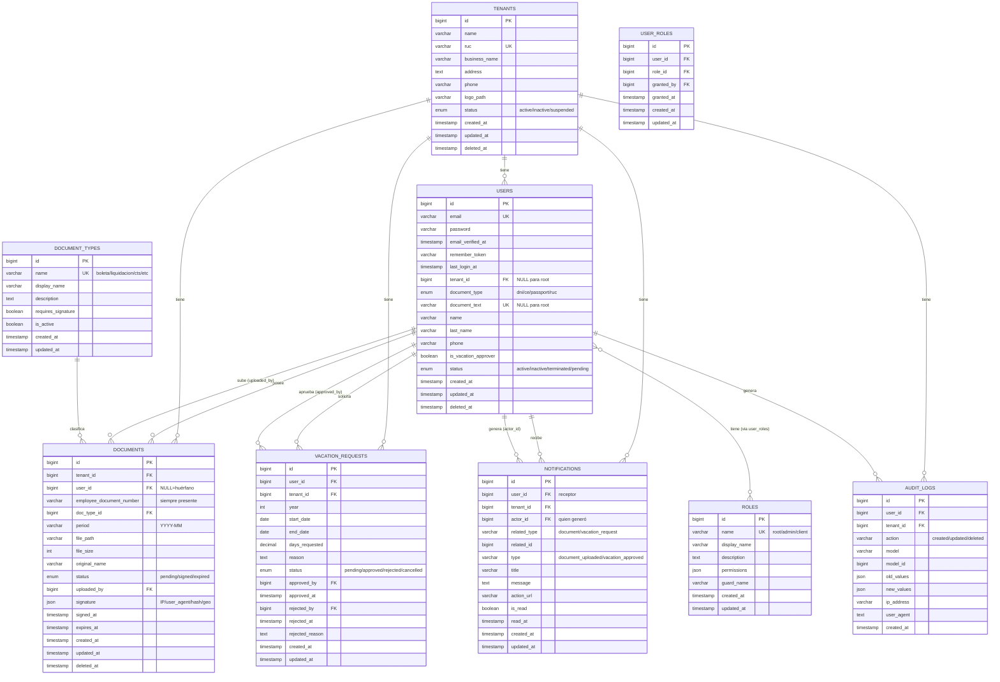

# Modelado de Base de Datos - MiBoleta (con Mermaid)

## Diagrama Entidad-Relación (Conceptual)



**NOTA IMPORTANTE:** 
- ✅ `document_types` = mantenedor de tipos de documentos (configurable)
- ✅ Firma digital: `signature` JSON + `signed_at` + `status` (auditoría completa)
- ✅ Notificaciones: cada usuario ve sus notificaciones (root/admin/client)
- ✅ Identificación flexible: `document_type` + `document_text` (DNI/CE/Passport/RUC)
- ✅ Documentos huérfanos: soporta subida antes de crear empleado

## Scripts SQL de Creación de Tablas

### 1. `tenants` (Organizaciones)

```sql
CREATE TABLE tenants (
    id BIGINT UNSIGNED AUTO_INCREMENT PRIMARY KEY,
    name VARCHAR(255) NOT NULL COMMENT 'Razón social corta',
    ruc VARCHAR(11) NOT NULL UNIQUE COMMENT 'RUC único',
    business_name VARCHAR(255) NOT NULL COMMENT 'Razón social completa',
    address TEXT NULL COMMENT 'Dirección fiscal',
    phone VARCHAR(20) NULL,
    logo_path VARCHAR(255) NULL COMMENT 'Ruta del logo',
    status ENUM('active', 'inactive', 'suspended') NOT NULL DEFAULT 'active',
    created_at TIMESTAMP NULL DEFAULT CURRENT_TIMESTAMP,
    updated_at TIMESTAMP NULL DEFAULT CURRENT_TIMESTAMP ON UPDATE CURRENT_TIMESTAMP,
    deleted_at TIMESTAMP NULL DEFAULT NULL,
    INDEX idx_status (status),
    INDEX idx_deleted_at (deleted_at)
) ENGINE=InnoDB DEFAULT CHARSET=utf8mb4 COLLATE=utf8mb4_unicode_ci;
```

### 2. `users` (Usuarios del Sistema)

```sql
CREATE TABLE users (
    id BIGINT UNSIGNED AUTO_INCREMENT PRIMARY KEY,
    email VARCHAR(255) NOT NULL UNIQUE,
    password VARCHAR(255) NOT NULL,
    email_verified_at TIMESTAMP NULL,
    remember_token VARCHAR(100) NULL,
    last_login_at TIMESTAMP NULL,
    tenant_id BIGINT UNSIGNED NULL COMMENT 'NULL = usuario root',
    document_type ENUM('dni', 'ce', 'passport', 'ruc') NOT NULL,
    document_text VARCHAR(20) NULL UNIQUE COMMENT 'NULL = usuario root',
    name VARCHAR(100) NOT NULL,
    last_name VARCHAR(100) NOT NULL,
    phone VARCHAR(20) NULL,
    is_vacation_approver BOOLEAN NOT NULL DEFAULT FALSE,
    status ENUM('active', 'inactive', 'terminated', 'pending') NOT NULL DEFAULT 'pending',
    created_at TIMESTAMP NULL DEFAULT CURRENT_TIMESTAMP,
    updated_at TIMESTAMP NULL DEFAULT CURRENT_TIMESTAMP ON UPDATE CURRENT_TIMESTAMP,
    deleted_at TIMESTAMP NULL DEFAULT NULL,
    FOREIGN KEY (tenant_id) REFERENCES tenants(id) ON DELETE CASCADE,
    INDEX idx_tenant_id (tenant_id),
    INDEX idx_status (status),
    INDEX idx_document (document_type, document_text),
    INDEX idx_deleted_at (deleted_at)
) ENGINE=InnoDB DEFAULT CHARSET=utf8mb4 COLLATE=utf8mb4_unicode_ci;
```

### 3. `roles` (Roles del Sistema)

```sql
CREATE TABLE roles (
    id BIGINT UNSIGNED AUTO_INCREMENT PRIMARY KEY,
    name VARCHAR(50) NOT NULL UNIQUE COMMENT 'root, admin, client',
    display_name VARCHAR(100) NOT NULL,
    description TEXT NULL,
    permissions JSON NULL COMMENT 'Permisos asociados al rol',
    guard_name VARCHAR(50) NOT NULL DEFAULT 'web',
    created_at TIMESTAMP NULL DEFAULT CURRENT_TIMESTAMP,
    updated_at TIMESTAMP NULL DEFAULT CURRENT_TIMESTAMP ON UPDATE CURRENT_TIMESTAMP,
    INDEX idx_name (name)
) ENGINE=InnoDB DEFAULT CHARSET=utf8mb4 COLLATE=utf8mb4_unicode_ci;
```

### 4. `user_roles` (Asignación de Roles)

```sql
CREATE TABLE user_roles (
    id BIGINT UNSIGNED AUTO_INCREMENT PRIMARY KEY,
    user_id BIGINT UNSIGNED NOT NULL,
    role_id BIGINT UNSIGNED NOT NULL,
    granted_by BIGINT UNSIGNED NULL COMMENT 'Usuario que otorgó el rol',
    granted_at TIMESTAMP NULL DEFAULT CURRENT_TIMESTAMP,
    created_at TIMESTAMP NULL DEFAULT CURRENT_TIMESTAMP,
    updated_at TIMESTAMP NULL DEFAULT CURRENT_TIMESTAMP ON UPDATE CURRENT_TIMESTAMP,
    FOREIGN KEY (user_id) REFERENCES users(id) ON DELETE CASCADE,
    FOREIGN KEY (role_id) REFERENCES roles(id) ON DELETE CASCADE,
    FOREIGN KEY (granted_by) REFERENCES users(id) ON DELETE SET NULL,
    UNIQUE KEY uk_user_role (user_id, role_id),
    INDEX idx_role_id (role_id),
    INDEX idx_granted_by (granted_by)
) ENGINE=InnoDB DEFAULT CHARSET=utf8mb4 COLLATE=utf8mb4_unicode_ci;
```

### 5. `document_types` (Tipos de Documentos)

```sql
CREATE TABLE document_types (
    id BIGINT UNSIGNED AUTO_INCREMENT PRIMARY KEY,
    name VARCHAR(50) NOT NULL UNIQUE COMMENT 'boleta, liquidacion, cts, etc.',
    display_name VARCHAR(100) NOT NULL,
    description TEXT NULL,
    requires_signature BOOLEAN NOT NULL DEFAULT TRUE,
    is_active BOOLEAN NOT NULL DEFAULT TRUE,
    created_at TIMESTAMP NULL DEFAULT CURRENT_TIMESTAMP,
    updated_at TIMESTAMP NULL DEFAULT CURRENT_TIMESTAMP ON UPDATE CURRENT_TIMESTAMP,
    INDEX idx_is_active (is_active)
) ENGINE=InnoDB DEFAULT CHARSET=utf8mb4 COLLATE=utf8mb4_unicode_ci;
```

### 6. `documents` (Documentos Laborales)

```sql
CREATE TABLE documents (
    id BIGINT UNSIGNED AUTO_INCREMENT PRIMARY KEY,
    tenant_id BIGINT UNSIGNED NOT NULL,
    user_id BIGINT UNSIGNED NULL COMMENT 'NULL = documento huérfano',
    employee_document_number VARCHAR(20) NOT NULL COMMENT 'Siempre presente para matching',
    doc_type_id BIGINT UNSIGNED NOT NULL,
    period VARCHAR(7) NOT NULL COMMENT 'YYYY-MM',
    file_path VARCHAR(500) NOT NULL,
    file_size INT UNSIGNED NOT NULL,
    original_name VARCHAR(255) NOT NULL,
    status ENUM('pending', 'signed', 'expired', 'orphan') NOT NULL DEFAULT 'pending',
    uploaded_by BIGINT UNSIGNED NOT NULL,
    signature JSON NULL COMMENT 'IP, user_agent, hash, geolocalización',
    signed_at TIMESTAMP NULL,
    expires_at TIMESTAMP NULL COMMENT 'Expiración automática si no firma',
    created_at TIMESTAMP NULL DEFAULT CURRENT_TIMESTAMP,
    updated_at TIMESTAMP NULL DEFAULT CURRENT_TIMESTAMP ON UPDATE CURRENT_TIMESTAMP,
    deleted_at TIMESTAMP NULL DEFAULT NULL,
    FOREIGN KEY (tenant_id) REFERENCES tenants(id) ON DELETE CASCADE,
    FOREIGN KEY (user_id) REFERENCES users(id) ON DELETE SET NULL,
    FOREIGN KEY (doc_type_id) REFERENCES document_types(id) ON DELETE RESTRICT,
    FOREIGN KEY (uploaded_by) REFERENCES users(id) ON DELETE RESTRICT,
    INDEX idx_tenant_user (tenant_id, user_id),
    INDEX idx_employee_doc (employee_document_number),
    INDEX idx_period (period),
    INDEX idx_status (status),
    INDEX idx_expires_at (expires_at),
    INDEX idx_deleted_at (deleted_at),
    UNIQUE KEY uk_tenant_doc (tenant_id, employee_document_number, doc_type_id, period)
) ENGINE=InnoDB DEFAULT CHARSET=utf8mb4 COLLATE=utf8mb4_unicode_ci;
```

### 7. `vacation_requests` (Solicitudes de Vacaciones)

```sql
CREATE TABLE vacation_requests (
    id BIGINT UNSIGNED AUTO_INCREMENT PRIMARY KEY,
    user_id BIGINT UNSIGNED NOT NULL,
    tenant_id BIGINT UNSIGNED NOT NULL,
    year INT NOT NULL COMMENT 'Año de las vacaciones',
    start_date DATE NOT NULL,
    end_date DATE NOT NULL,
    days_requested DECIMAL(4,1) NOT NULL COMMENT 'Días solicitados (puede incluir 0.5)',
    reason TEXT NULL,
    status ENUM('pending', 'approved', 'rejected', 'cancelled') NOT NULL DEFAULT 'pending',
    approved_by BIGINT UNSIGNED NULL,
    approved_at TIMESTAMP NULL,
    rejected_by BIGINT UNSIGNED NULL,
    rejected_at TIMESTAMP NULL,
    rejected_reason TEXT NULL,
    created_at TIMESTAMP NULL DEFAULT CURRENT_TIMESTAMP,
    updated_at TIMESTAMP NULL DEFAULT CURRENT_TIMESTAMP ON UPDATE CURRENT_TIMESTAMP,
    FOREIGN KEY (user_id) REFERENCES users(id) ON DELETE CASCADE,
    FOREIGN KEY (tenant_id) REFERENCES tenants(id) ON DELETE CASCADE,
    FOREIGN KEY (approved_by) REFERENCES users(id) ON DELETE SET NULL,
    FOREIGN KEY (rejected_by) REFERENCES users(id) ON DELETE SET NULL,
    INDEX idx_user_year (user_id, year),
    INDEX idx_tenant_id (tenant_id),
    INDEX idx_status (status),
    INDEX idx_dates (start_date, end_date)
) ENGINE=InnoDB DEFAULT CHARSET=utf8mb4 COLLATE=utf8mb4_unicode_ci;
```

### 8. `notifications` (Notificaciones)

```sql
CREATE TABLE notifications (
    id BIGINT UNSIGNED AUTO_INCREMENT PRIMARY KEY,
    user_id BIGINT UNSIGNED NOT NULL COMMENT 'Usuario que recibe la notificación',
    tenant_id BIGINT UNSIGNED NOT NULL,
    actor_id BIGINT UNSIGNED NULL COMMENT 'Usuario que generó la acción',
    related_type VARCHAR(50) NULL COMMENT 'document, vacation_request, etc.',
    related_id BIGINT UNSIGNED NULL COMMENT 'ID del registro relacionado',
    type VARCHAR(100) NOT NULL COMMENT 'document_uploaded, vacation_approved, etc.',
    title VARCHAR(255) NOT NULL,
    message TEXT NOT NULL,
    action_url VARCHAR(500) NULL COMMENT 'URL de la acción relacionada',
    is_read BOOLEAN NOT NULL DEFAULT FALSE,
    read_at TIMESTAMP NULL,
    created_at TIMESTAMP NULL DEFAULT CURRENT_TIMESTAMP,
    updated_at TIMESTAMP NULL DEFAULT CURRENT_TIMESTAMP ON UPDATE CURRENT_TIMESTAMP,
    FOREIGN KEY (user_id) REFERENCES users(id) ON DELETE CASCADE,
    FOREIGN KEY (tenant_id) REFERENCES tenants(id) ON DELETE CASCADE,
    FOREIGN KEY (actor_id) REFERENCES users(id) ON DELETE SET NULL,
    INDEX idx_user_read (user_id, is_read),
    INDEX idx_tenant_id (tenant_id),
    INDEX idx_created_at (created_at),
    INDEX idx_related (related_type, related_id)
) ENGINE=InnoDB DEFAULT CHARSET=utf8mb4 COLLATE=utf8mb4_unicode_ci;
```

### 9. `audit_logs` (Auditoría)

```sql
CREATE TABLE audit_logs (
    id BIGINT UNSIGNED AUTO_INCREMENT PRIMARY KEY,
    user_id BIGINT UNSIGNED NULL COMMENT 'NULL = acción del sistema',
    tenant_id BIGINT UNSIGNED NULL,
    action VARCHAR(50) NOT NULL COMMENT 'created, updated, deleted, etc.',
    model VARCHAR(100) NOT NULL COMMENT 'Nombre del modelo',
    model_id BIGINT UNSIGNED NOT NULL COMMENT 'ID del registro afectado',
    old_values JSON NULL COMMENT 'Valores anteriores',
    new_values JSON NULL COMMENT 'Valores nuevos',
    ip_address VARCHAR(45) NULL,
    user_agent TEXT NULL,
    created_at TIMESTAMP NULL DEFAULT CURRENT_TIMESTAMP,
    FOREIGN KEY (user_id) REFERENCES users(id) ON DELETE SET NULL,
    FOREIGN KEY (tenant_id) REFERENCES tenants(id) ON DELETE CASCADE,
    INDEX idx_user_id (user_id),
    INDEX idx_tenant_id (tenant_id),
    INDEX idx_model (model, model_id),
    INDEX idx_created_at (created_at)
) ENGINE=InnoDB DEFAULT CHARSET=utf8mb4 COLLATE=utf8mb4_unicode_ci;
```

---

## Scripts SQL de Inserción de Datos Iniciales

### Roles del Sistema

```sql
-- Insertar roles predefinidos
INSERT INTO roles (name, display_name, description, permissions) VALUES
('root', 'Super Administrador', 'Acceso total al sistema, gestiona tenants', 
 '["*"]'),
('admin', 'Administrador', 'Administrador de tenant, gestiona usuarios y documentos', 
 '["users.manage", "documents.manage", "vacations.approve", "reports.view"]'),
('client', 'Cliente/Empleado', 'Usuario final que ve sus documentos y solicita vacaciones', 
 '["documents.view", "documents.sign", "vacations.request", "profile.edit"]');
```

### Tipos de Documentos

```sql
-- Insertar tipos de documentos comunes
INSERT INTO document_types (name, display_name, description, requires_signature) VALUES
('boleta', 'Boleta de Pago', 'Boleta mensual de remuneraciones', TRUE),
('liquidacion', 'Liquidación de Beneficios Sociales', 'Liquidación por cese', TRUE),
('cts', 'CTS', 'Compensación por Tiempo de Servicios', TRUE),
('gratificacion', 'Gratificación', 'Gratificación extraordinaria', TRUE),
('utilidades', 'Utilidades', 'Participación en utilidades', TRUE),
('vacaciones', 'Constancia de Vacaciones', 'Constancia de vacaciones tomadas', FALSE),
('contrato', 'Contrato de Trabajo', 'Contrato laboral', TRUE),
('addendum', 'Addendum', 'Modificación de contrato', TRUE);
```

### Usuario Root (Ejemplo)

```sql
-- Crear usuario root (password: "password" hasheado con bcrypt)
INSERT INTO users (email, password, document_type, document_text, name, last_name, status, email_verified_at)
VALUES (
    'root@miboleta.com',
    '$2y$12$LQv3c1yqBWVHxkd0LHAkCOYz6TtxMQJqhN8/LewY5GyJN0lf5eRpW',
    'dni',
    NULL,
    'Super',
    'Admin',
    'active',
    NOW()
);

-- Asignar rol root
INSERT INTO user_roles (user_id, role_id, granted_by)
SELECT u.id, r.id, u.id
FROM users u
CROSS JOIN roles r
WHERE u.email = 'root@miboleta.com' AND r.name = 'root';
```

### Tenant de Ejemplo

```sql
-- Crear tenant de ejemplo
INSERT INTO tenants (name, ruc, business_name, address, phone, status)
VALUES (
    'Empresa Demo SAC',
    '20123456789',
    'Empresa Demo Sociedad Anónima Cerrada',
    'Av. Ejemplo 123, Lima, Perú',
    '+51 999 999 999',
    'active'
);

-- Crear admin del tenant
INSERT INTO users (email, password, tenant_id, document_type, document_text, name, last_name, phone, status, email_verified_at)
SELECT 
    'admin@demo.com',
    '$2y$12$LQv3c1yqBWVHxkd0LHAkCOYz6TtxMQJqhN8/LewY5GyJN0lf5eRpW',
    t.id,
    'dni',
    '12345678',
    'Juan',
    'Pérez',
    '+51 999 888 777',
    'active',
    NOW()
FROM tenants t WHERE t.ruc = '20123456789';

-- Asignar rol admin
INSERT INTO user_roles (user_id, role_id, granted_by)
SELECT u.id, r.id, (SELECT id FROM users WHERE email = 'root@miboleta.com')
FROM users u
CROSS JOIN roles r
WHERE u.email = 'admin@demo.com' AND r.name = 'admin';

-- Crear empleado cliente
INSERT INTO users (email, password, tenant_id, document_type, document_text, name, last_name, phone, status, email_verified_at)
SELECT 
    'empleado@demo.com',
    '$2y$12$LQv3c1yqBWVHxkd0LHAkCOYz6TtxMQJqhN8/LewY5GyJN0lf5eRpW',
    t.id,
    'dni',
    '87654321',
    'María',
    'González',
    '+51 999 777 666',
    'active',
    NOW()
FROM tenants t WHERE t.ruc = '20123456789';

-- Asignar rol client
INSERT INTO user_roles (user_id, role_id, granted_by)
SELECT u.id, r.id, (SELECT id FROM users WHERE email = 'admin@demo.com')
FROM users u
CROSS JOIN roles r
WHERE u.email = 'empleado@demo.com' AND r.name = 'client';
```

### Documento de Ejemplo

```sql
-- Crear documento (boleta) para el empleado
INSERT INTO documents (
    tenant_id, 
    user_id, 
    employee_document_number, 
    doc_type_id, 
    period, 
    file_path, 
    file_size, 
    original_name, 
    status, 
    uploaded_by,
    expires_at
)
SELECT 
    t.id,
    u.id,
    '87654321',
    dt.id,
    '2025-11',
    'documents/2025/11/boleta_87654321_202511.pdf',
    245678,
    'boleta_noviembre_2025.pdf',
    'pending',
    admin.id,
    DATE_ADD(NOW(), INTERVAL 30 DAY)
FROM tenants t
CROSS JOIN users u
CROSS JOIN document_types dt
CROSS JOIN users admin
WHERE t.ruc = '20123456789'
  AND u.email = 'empleado@demo.com'
  AND dt.name = 'boleta'
  AND admin.email = 'admin@demo.com';
```

### Notificación de Ejemplo

```sql
-- Crear notificación de documento subido
INSERT INTO notifications (
    user_id,
    tenant_id,
    actor_id,
    related_type,
    related_id,
    type,
    title,
    message,
    action_url
)
SELECT 
    u.id,
    t.id,
    admin.id,
    'document',
    d.id,
    'document_uploaded',
    'Nueva boleta disponible',
    'Tu boleta de Noviembre 2025 está disponible para firma',
    '/documents/' || d.id
FROM users u
CROSS JOIN tenants t
CROSS JOIN users admin
CROSS JOIN documents d
WHERE u.email = 'empleado@demo.com'
  AND t.ruc = '20123456789'
  AND admin.email = 'admin@demo.com'
  AND d.period = '2025-11';
```

---

## Orden de Ejecución

Para crear la base de datos completa, ejecuta en este orden:

1. **Tablas base:** `tenants` → `users` → `roles`
2. **Relaciones:** `user_roles` → `document_types`
3. **Documentos:** `documents`
4. **Otros:** `vacation_requests` → `notifications` → `audit_logs`
5. **Datos iniciales:** Roles → Document Types → Root User → Tenant de prueba

**Nota:** Laravel Migrations creará estas tablas automáticamente siguiendo este orden.
