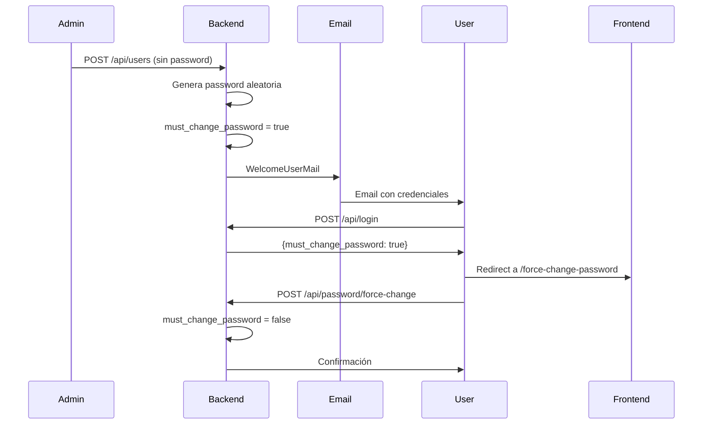
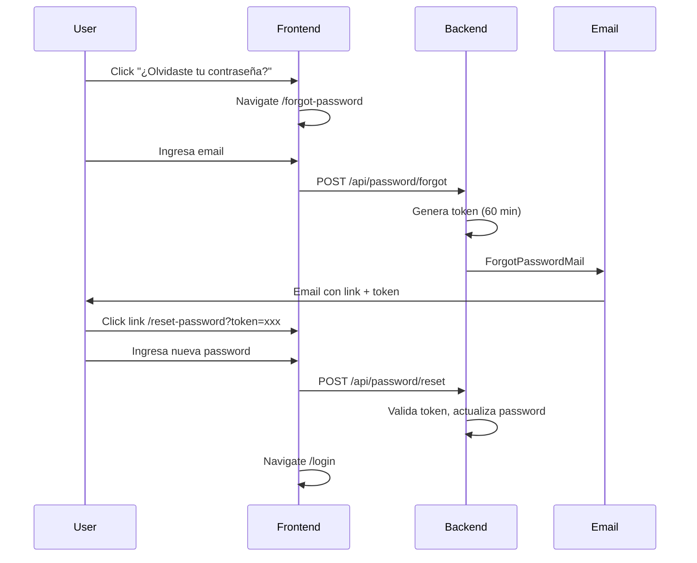
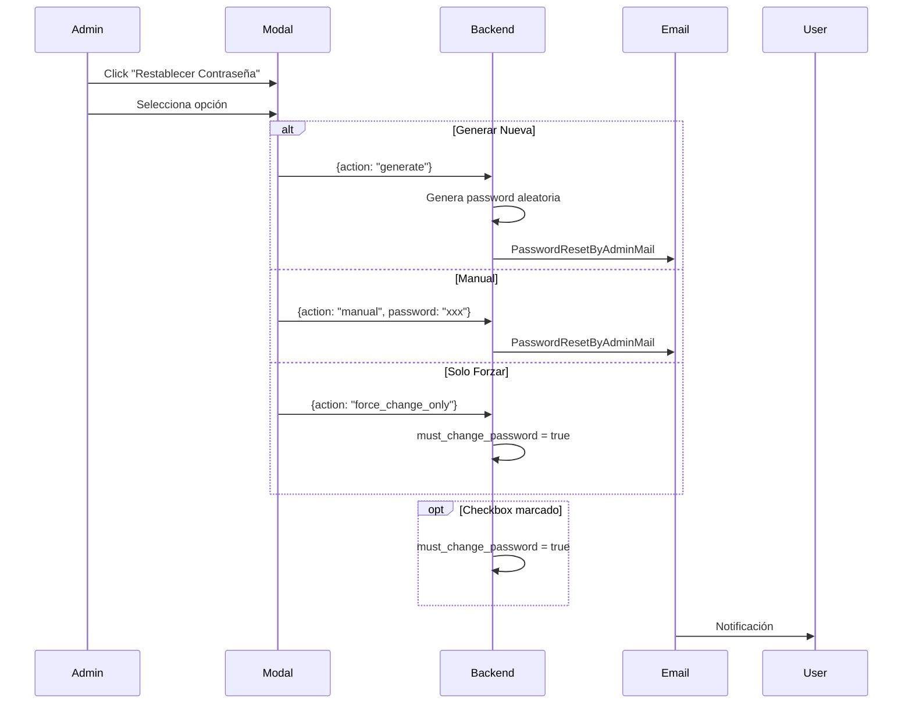

# 🔐 Sistema de Gestión de Contraseñas

**Fecha de implementación:** 2025-12-10  
**Estado:** ✅ Completado

---

## 📋 Resumen Ejecutivo

Sistema integral de gestión de contraseñas que incluye:

- **Creación de usuarios**: Generación automática de contraseñas y envío por email
- **Primer login obligatorio**: Fuerza cambio de contraseña en primer acceso
- **Recuperación de contraseña**: Flujo completo "Olvidé mi contraseña"
- **Reset por administrador**: Modal con múltiples opciones (generar, manual, forzar)

---

## 🏗️ Arquitectura

### Backend (Laravel)

```
app/
├── Http/
│   ├── Controllers/Api/
│   │   ├── AuthController.php         # Login/logout/me (con must_change_password)
│   │   ├── PasswordController.php     # 5 endpoints de gestión
│   │   └── UserController.php         # Generación de password al crear
│   └── Middleware/
│       └── CheckMustChangePassword.php # Fuerza cambio (FUTURO)
├── Mail/
│   ├── WelcomeUserMail.php
│   ├── PasswordResetByAdminMail.php
│   └── ForgotPasswordMail.php
└── Models/
    └── User.php                        # must_change_password, password_changed_at

database/
└── migrations/
    └── 2025_12_11_000952_add_password_management_to_users_table.php

resources/
└── views/
    └── emails/
        ├── welcome.blade.php
        ├── password-reset-admin.blade.php
        └── forgot-password.blade.php
```

### Frontend (React + TypeScript)

```
src/
├── core/domain/entities/
│   └── User.ts                         # must_change_password field
├── presentation/
│   ├── components/users/
│   │   └── PasswordResetModal.tsx      # Modal admin estilo Amazon
│   ├── pages/
│   │   ├── admin/
│   │   │   ├── UserFormPage.tsx        # Sin password al crear
│   │   │   └── UserDetailPage.tsx      # Botón "Restablecer"
│   │   └── auth/
│   │       ├── LoginView.tsx           # Link olvidé + redirect
│   │       ├── ForceChangePasswordPage.tsx
│   │       ├── ForgotPasswordPage.tsx
│   │       └── ResetPasswordPage.tsx
│   └── routes/
│       └── index.tsx                   # Rutas públicas password
```

---

## 🗄️ Base de Datos

### Columnas Agregadas a `users`

| Columna | Tipo | Descripción |
|---------|------|-------------|
| `must_change_password` | `boolean` | Flag para forzar cambio (default: false) |
| `password_changed_at` | `datetime` | Timestamp del último cambio (nullable) |

### Tabla Existente: `password_reset_tokens`

| Columna | Tipo | Descripción |
|---------|------|-------------|
| `email` | `string` | Email del usuario |
| `token` | `string` | Hash del token de reset |
| `created_at` | `timestamp` | Fecha de creación (expira en 60 min) |

---

## 📡 API Endpoints

### PasswordController

| Método | Ruta | Descripción | Auth |
|--------|------|-------------|------|
| POST | `/api/password/forgot` | Solicita link de recuperación | No |
| POST | `/api/password/reset` | Restablece con token | No |
| POST | `/api/password/change` | Cambio por usuario autenticado | Sí |
| POST | `/api/password/force-change` | Cambio forzado (primer login) | Sí |
| POST | `/api/users/{id}/reset-password` | Admin reset con opciones | Sí |

### AuthController (modificado)

| Método | Campo Nuevo | Descripción |
|--------|-------------|-------------|
| `POST /api/login` | `must_change_password` | Indica si debe cambiar password |
| `POST /api/refresh` | `must_change_password` | Mantiene flag en refresh |
| `GET /api/me` | `must_change_password` | Retorna estado actual |

### UserController (modificado)

**Método `store()`:**
1. Genera password aleatoria (12 caracteres: letras + números + símbolos)
2. Establece `must_change_password = true`
3. Envía `WelcomeUserMail` con credenciales temporales
4. Retorna usuario creado

---

## 📧 Emails

### 1. WelcomeUserMail
**Trigger:** Creación de usuario  
**Datos:**
- Nombre del usuario
- Email de acceso
- Password temporal
- URL de login

**Template:** `resources/views/emails/welcome.blade.php`

```blade
<div class="credentials-panel">
  <strong>Email:</strong> {{ $user->email }}
  <strong>Contraseña temporal:</strong> {{ $temporaryPassword }}
</div>
<a href="{{ $loginUrl }}">Iniciar Sesión</a>
```

### 2. PasswordResetByAdminMail
**Trigger:** Admin restablece contraseña  
**Datos:**
- Nombre del usuario
- Password nueva (condicional)
- Flag `must_change_password`

**Template:** `resources/views/emails/password-reset-admin.blade.php`

```blade
@if($newPassword)
  <strong>Nueva contraseña:</strong> {{ $newPassword }}
@endif

@if($mustChangePassword)
  <div class="alert">Deberás cambiarla en tu próximo inicio de sesión</div>
@endif
```

### 3. ForgotPasswordMail
**Trigger:** Usuario solicita recuperación  
**Datos:**
- Nombre del usuario
- Token de reset
- URL con token
- Tiempo de expiración (60 minutos)

**Template:** `resources/views/emails/forgot-password.blade.php`

```blade
<a href="{{ $resetUrl }}">Restablecer Contraseña</a>
<p>Este enlace expirará en {{ $expiresInMinutes }} minutos.</p>
```

**Diseño:** Todos los templates usan gradiente azul (`#2563EB` → `#1E40AF`) con cards blancas para coincidir con el frontend.

---

## 🔄 Flujos de Usuario

### Flujo 1: Creación de Usuario Nuevo



### Flujo 2: Olvidé mi Contraseña



### Flujo 3: Admin Reset Password



---

## 🎨 Frontend

### Componentes

#### 1. ForceChangePasswordPage
**Ruta:** `/force-change-password`

**Campos:**
- Password actual
- Nueva password (min 8 caracteres)
- Confirmar password

**Validaciones:**
- Password actual correcta
- Nueva password ≥ 8 caracteres
- Confirmación match

**API:** `POST /api/password/force-change`

**Success:** Recarga usuario con `useAuthStore().me()`, redirect al dashboard

#### 2. ForgotPasswordPage
**Ruta:** `/forgot-password`

**Estados:**
- Formulario (input email)
- Éxito (mensaje de confirmación + tips)

**API:** `POST /api/password/forgot`

#### 3. ResetPasswordPage
**Ruta:** `/reset-password?token=xxx&email=xxx`

**Campos:**
- Nueva password
- Confirmar password

**API:** `POST /api/password/reset`

**Success:** Redirect a `/login`

#### 4. PasswordResetModal (Admin)

**Opciones:**

```tsx
type ResetAction = 'generate' | 'manual' | 'force_change_only';
```

**Opción 1: Generar nueva** 🔑
- Backend genera password aleatoria
- Envía email automáticamente
- Checkbox: "Requerir cambio en próximo login"

**Opción 2: Establecer manualmente** ✍️
- Admin escribe password personalizada
- Input con validación (min 8 caracteres)
- Email de notificación enviado
- Checkbox: "Requerir cambio en próximo login"

**Opción 3: Solo forzar cambio** ⚠️
- Mantiene password actual
- Solo marca `must_change_password = true`
- No envía email

**API:** `POST /api/users/{id}/reset-password`

### Modificaciones

#### LoginView
```tsx
// Enlace agregado
<Link to="/forgot-password">¿Olvidaste tu contraseña?</Link>

// Redirección post-login
if (userData?.must_change_password) {
  navigate('/force-change-password');
  toast.info('Debes cambiar tu contraseña');
}
```

#### UserFormPage
```tsx
// Al crear usuario (userId === null)
{!userId && (
  <Alert>
    <Mail className="h-4 w-4" />
    Se enviará un email con credenciales temporales.
    El usuario deberá cambiarlas en el primer inicio de sesión.
  </Alert>
)}

// Al editar usuario (userId !== null)
{userId && (
  <div>
    {/* Campos de password */}
  </div>
)}
```

#### UserDetailPage
```tsx
// Botón agregado en acciones
<Button
  variant="outline"
  onClick={() => setIsPasswordResetOpen(true)}
  className="text-orange-600"
>
  <KeyRound className="h-4 w-4 mr-2" />
  Restablecer Contraseña
</Button>

// Modal renderizado
<PasswordResetModal
  open={isPasswordResetOpen}
  onOpenChange={setIsPasswordResetOpen}
  userId={user.id}
  userName={user.full_name}
  onSuccess={() => loadUser(user.id)}
/>
```

---

## ✅ Validaciones

### Backend

| Endpoint | Validaciones |
|----------|--------------|
| `forgotPassword` | `email` required\|exists:users |
| `resetPassword` | `token` required, `email` required\|exists, `password` min:8\|confirmed |
| `changePassword` | `current_password` required, `password` min:8\|confirmed |
| `forceChangePassword` | `current_password` required, `password` min:8\|confirmed |
| `adminResetPassword` | `action` in:generate,manual,force_change_only <br> `password` required_if:action,manual |

### Frontend

| Componente | Validaciones |
|------------|--------------|
| ForceChangePasswordPage | Current password requerida <br> Nueva password ≥8 chars <br> Confirmación match |
| ForgotPasswordPage | Email formato válido |
| ResetPasswordPage | Password ≥8 chars <br> Confirmación match |
| PasswordResetModal | En modo manual: password ≥8 chars |

---

## 🔒 Seguridad

| Aspecto | Implementación |
|---------|----------------|
| **Hash** | `bcrypt` para todas las contraseñas |
| **Tokens de reset** | Expiran en 60 minutos |
| **Autenticación** | HttpOnly cookies (Sanctum) |
| **Validación previa** | Requiere password actual para cambios |
| **Generación segura** | `Str::random(12)` con letras, números y símbolos |
| **Emails** | Templates sanitizados con Blade |

---

## 🧪 Testing

### Manual Testing Checklist

- [ ] **Crear usuario** → Verificar email en `storage/logs/laravel.log`
- [ ] **Primer login** → Confirmar redirección a `/force-change-password`
- [ ] **Cambio forzado** → Verificar `must_change_password = false` después
- [ ] **Forgot password** → Validar token en email y expiración
- [ ] **Reset con token** → Confirmar login con nueva password
- [ ] **Admin reset - Generar** → Verificar email enviado
- [ ] **Admin reset - Manual** → Confirmar password funciona
- [ ] **Admin reset - Force only** → Verificar flag en próximo login
- [ ] **Checkbox force** → Confirmar forzado en próximo login

### Comandos útiles

```bash
# Ver emails en desarrollo
tail -f storage/logs/laravel.log | grep "WelcomeUserMail"

# Limpiar tokens expirados
php artisan tinker
>>> DB::table('password_reset_tokens')->where('created_at', '<', now()->subHour())->delete();

# Forzar cambio de password a usuario específico
>>> User::find(5)->update(['must_change_password' => true]);
```

---

## 📂 Archivos Creados/Modificados

### Backend

**Nuevos:**
- `app/Http/Controllers/Api/PasswordController.php`
- `app/Mail/WelcomeUserMail.php`
- `app/Mail/PasswordResetByAdminMail.php`
- `app/Mail/ForgotPasswordMail.php`
- `resources/views/emails/welcome.blade.php`
- `resources/views/emails/password-reset-admin.blade.php`
- `resources/views/emails/forgot-password.blade.php`
- `database/migrations/2025_12_11_000952_add_password_management_to_users_table.php`

**Modificados:**
- `app/Http/Controllers/Api/AuthController.php` (añade `must_change_password` a responses)
- `app/Http/Controllers/Api/UserController.php` (genera password + envía email)
- `app/Models/User.php` (añade campos a `$fillable` y `$casts`)
- `routes/api.php` (añade rutas de password)

### Frontend

**Nuevos:**
- `src/presentation/components/users/PasswordResetModal.tsx`
- `src/presentation/pages/auth/ForceChangePasswordPage.tsx`
- `src/presentation/pages/auth/ForgotPasswordPage.tsx`
- `src/presentation/pages/auth/ResetPasswordPage.tsx`

**Modificados:**
- `src/core/domain/entities/User.ts` (añade `must_change_password`)
- `src/presentation/pages/auth/LoginView.tsx` (enlace + redirect)
- `src/presentation/pages/admin/UserFormPage.tsx` (sin password al crear)
- `src/presentation/pages/admin/UserDetailPage.tsx` (botón + modal)
- `src/presentation/routes/index.tsx` (rutas públicas)
- `src/presentation/components/users/index.ts` (export modal)

---

## 🚀 Deployment

### Variables de Entorno

```env
# Desarrollo
MAIL_MAILER=log
MAIL_HOST=127.0.0.1
MAIL_PORT=2525

# Producción (ejemplo con SendGrid)
MAIL_MAILER=smtp
MAIL_HOST=smtp.sendgrid.net
MAIL_PORT=587
MAIL_USERNAME=apikey
MAIL_PASSWORD=SG.xxxxxxxxxxxxx
MAIL_ENCRYPTION=tls
MAIL_FROM_ADDRESS=noreply@miboleta.com
MAIL_FROM_NAME="MiBoleta"
```

### Pasos de Deploy

1. **Migración:**
   ```bash
   php artisan migrate
   ```

2. **Configurar email:**
   - Desarrollo: revisar logs
   - Producción: configurar SMTP real

3. **Frontend build:**
   ```bash
   npm run build
   ```

4. **Testing post-deploy:**
   - Crear usuario de prueba
   - Verificar email recibido
   - Probar flujo completo

---

## 📊 Métricas

| Métrica | Valor |
|---------|-------|
| **Archivos creados** | 10 backend + 4 frontend |
| **Archivos modificados** | 4 backend + 5 frontend |
| **Endpoints nuevos** | 5 (/password/*) |
| **Líneas de código** | ~1,500+ |
| **Emails templates** | 3 |
| **Componentes React** | 4 páginas + 1 modal |

---

## 🎯 Próximos Pasos (Futuro)

- [ ] Implementar `CheckMustChangePassword` middleware (forzar via backend)
- [ ] Agregar configuración de complejidad de passwords en admin
- [ ] Historial de contraseñas (no reutilizar últimas 5)
- [ ] Expiración automática de contraseñas cada 90 días
- [ ] MFA (Multi-Factor Authentication)
- [ ] Logs de auditoría para cambios de password

---

## 📖 Referencias

- [Laravel Mail](https://laravel.com/docs/11.x/mail)
- [Laravel Password Reset](https://laravel.com/docs/11.x/passwords)
- [React Hook Form](https://react-hook-form.com/)
- [Lucide Icons](https://lucide.dev/)

---

**Última actualización:** 2025-12-10  
**Versión:** 1.0  
**Estado:** ✅ Producción
