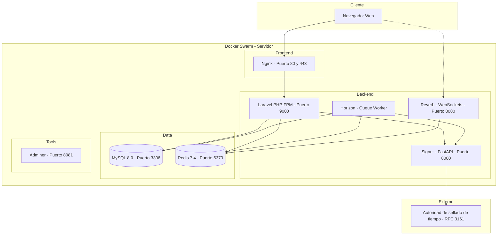
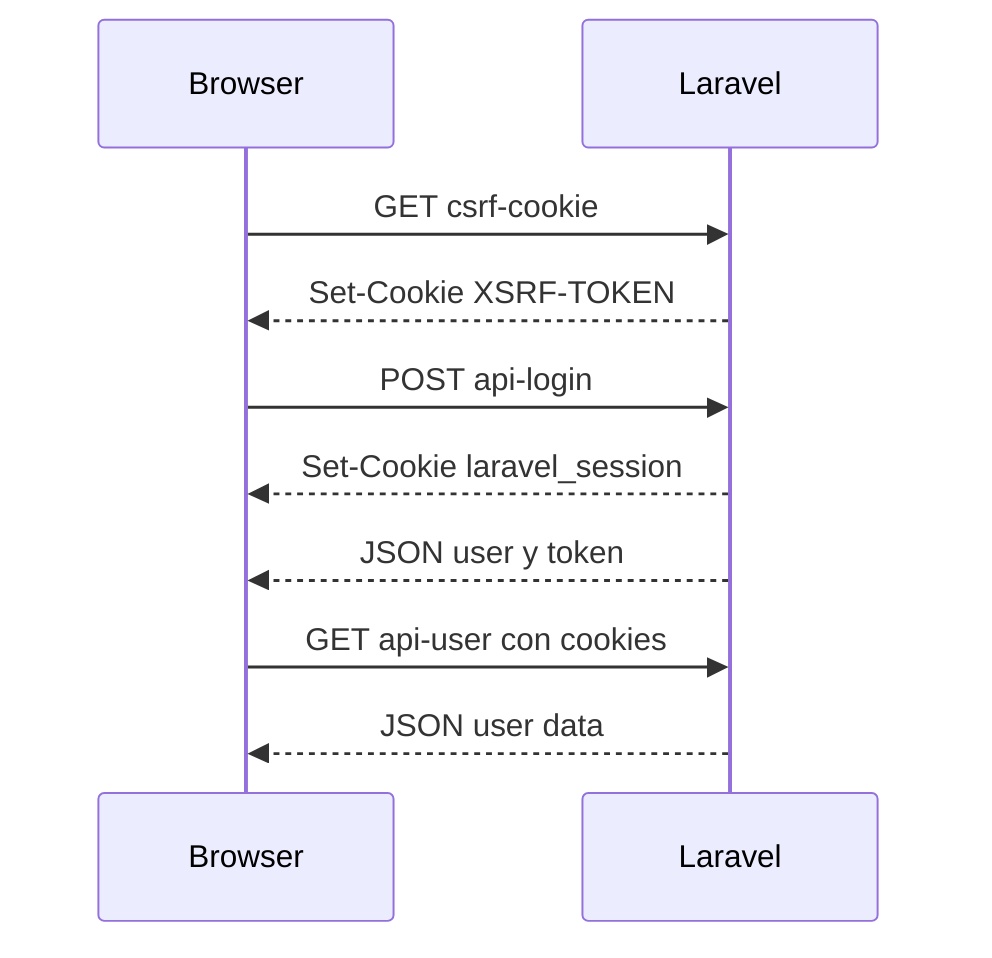
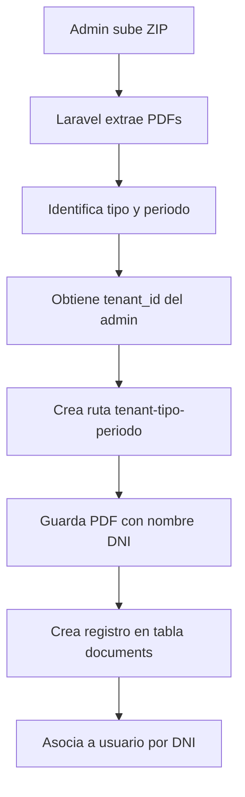

# MiBoleta - Documentación Técnica

## Información del Documento

| Atributo            | Valor                                               |
| ------------------- | --------------------------------------------------- |
| **Versión**  | 1.1.0                                               |
| **Fecha**     | Agosto 2026                                         |
| **Audiencia** | Desarrolladores, DevOps, Administradores de Sistema |

---

## 1. Arquitectura del Sistema

### 1.1 Diagrama de Arquitectura



**Sobre el servicio `signer`.** Es un servicio aparte, en Python (FastAPI), que
firma los PDF criptográficamente en formato PAdES. Está separado del contenedor
de Laravel a propósito: necesita Ghostscript para normalizar el PDF a PDF/A-2b y
pyHanko para firmar, un stack que no tiene sentido meter en la imagen de PHP.
Laravel le habla por HTTP dentro de la red interna (`SIGNER_BASE_URL`) y ambos
comparten el volumen `storage_data`, para que el PDF no viaje por la red.

El sellado de tiempo (TSA) es la única dependencia externa en tiempo de
ejecución: sin salida a internet, la firma se produce igualmente pero sin sello
de tiempo cualificado.

### 1.2 Stack Tecnológico

#### Frontend

| Tecnología  | Versión | Uso                     |
| ------------ | -------- | ----------------------- |
| React        | 18.3     | Framework UI            |
| TypeScript   | 5.x      | Tipado estático        |
| Vite         | 6.3      | Build tool y dev server |
| TailwindCSS  | 4.1      | Estilos                 |
| React Query  | 5.x      | Estado servidor         |
| React Router | 7.x      | Navegación SPA         |
| Zustand      | 5.x      | Estado global           |
| Radix UI     | 1.x      | Componentes accesibles  |

#### Backend

| Tecnología     | Versión | Uso                |
| --------------- | -------- | ------------------ |
| PHP             | 8.4      | Lenguaje           |
| Laravel         | 12.x     | Framework          |
| Laravel Sanctum | -        | Autenticación API |
| Laravel Horizon | -        | Queue Dashboard    |
| Laravel Reverb  | -        | WebSockets         |
| MySQL           | 8.0      | Base de datos      |
| Redis           | 7.4      | Cache y Queues     |

#### Servicio de firma (contenedor aparte)

| Tecnología  | Uso                                                      |
| ------------ | -------------------------------------------------------- |
| Python + FastAPI | Servicio HTTP interno de firma                       |
| Ghostscript  | Normalización del PDF a PDF/A-2b antes de firmar         |
| pyHanko      | Firma PAdES sobre el PDF normalizado                     |
| TSA (RFC 3161) | Sellado de tiempo cualificado (dependencia externa)    |

#### Infraestructura

| Tecnología    | Versión | Uso                |
| -------------- | -------- | ------------------ |
| Docker         | Latest   | Contenedorización |
| Docker Swarm   | -        | Orquestación      |
| Nginx          | 1.27     | Reverse proxy      |
| GitHub Actions | -        | CI/CD              |
| GHCR           | -        | Container Registry |

### 1.3 Estructura de Carpetas

```
miboleta/
├── .github/
│   └── workflows/
│       └── docker-build-deploy.yml    # CI/CD Pipeline
├── backend/                           # Laravel Application
│   ├── app/
│   │   ├── Http/Controllers/Api/      # API Controllers
│   │   ├── Models/                    # Eloquent Models
│   │   └── Services/                  # Business Logic
│   ├── config/                        # Laravel Config
│   ├── database/
│   │   ├── factories/                 # Model Factories
│   │   ├── migrations/                # DB Migrations
│   │   └── seeders/                   # DB Seeders
│   ├── resources/
│   │   └── views/emails/              # Email Templates
│   ├── routes/
│   │   └── api.php                    # API Routes
│   └── storage/
│       └── app/documents/             # Uploaded PDFs
├── src/                               # React Frontend
│   ├── application/                   # Business Logic
│   │   └── hooks/                     # Custom Hooks
│   ├── domain/                        # Domain Types
│   ├── infrastructure/                # API Layer
│   │   ├── api/                       # API Clients
│   │   └── store/                     # Zustand Stores
│   └── presentation/                  # UI Layer
│       ├── components/                # Shared Components
│       ├── pages/                     # Page Components
│       └── routes/                    # Route Definitions
├── config/                            # Swarm Config
│   ├── .env                           # Backend env (Swarm)
│   ├── my.cnf                         # MySQL config
│   └── nginx.conf                     # Nginx config
├── docker/                            # Docker configs
├── docs/                              # Documentation
├── Dockerfile                         # Multi-stage build
├── docker-compose.yml                 # Development
├── docker-stack.yml                   # Production Swarm
└── package.json                       # NPM scripts
```

---

## 2. Configuración de Desarrollo Local

### 2.1 Requisitos Previos

| Requisito      | Versión Mínima | Notas                    |
| -------------- | ---------------- | ------------------------ |
| Node.js        | 18.x             | Para frontend            |
| Docker         | 20.x             | Para backend local       |
| Docker Compose | 2.x              | Para orquestación local |
| Git            | 2.x              | Control de versiones     |

### 2.2 Instalación Paso a Paso

#### 1. Clonar el repositorio

```bash
git clone https://github.com/jorgevasquezutec/miboleta.git
cd miboleta
```

#### 2. Configurar variables de entorno del backend

```bash
# Copiar el archivo de ejemplo
cp backend/.env.example backend/.env

# Editar el archivo con tus configuraciones (opcional para desarrollo local)
# Las configuraciones por defecto funcionan con Docker Compose
```

**Configuraciones importantes en `backend/.env`:**

| Variable | Valor Local | Descripción |
|----------|-------------|-------------|
| `APP_URL` | `http://localhost` | URL del backend |
| `DB_HOST` | `db` | Host de MySQL (nombre del servicio Docker) |
| `DB_DATABASE` | `miboleta` | Nombre de la base de datos |
| `DB_USERNAME` | `root` | Usuario de MySQL |
| `DB_PASSWORD` | `root` | Password de MySQL |
| `REDIS_HOST` | `redis` | Host de Redis (nombre del servicio Docker) |

#### 3. Instalar dependencias de frontend

```bash
npm install
```

#### 4. Levantar el ambiente completo

```bash
npm run dev:local
```

Este script automáticamente:

1. ✅ Configura `.env.local` para Vite (frontend)
2. ✅ Actualiza variables de `backend/.env` para localhost
3. ✅ Inicia Docker Compose (Laravel, MySQL, Redis, Nginx, Horizon, Reverb)
4. ✅ Espera a que la base de datos esté lista
5. ✅ El `docker-entrypoint.sh` ejecuta migraciones automáticamente
6. ✅ Inicia Vite dev server con hot-reload

#### 5. Acceder al sistema

Una vez iniciado, tendrás acceso a:

| Servicio | URL | Descripción |
|----------|-----|-------------|
| **Frontend** | http://localhost:5173 | React con hot-reload |
| **API** | http://localhost/api | Laravel API |
| **WebSocket** | ws://localhost:8085 | Reverb para notificaciones |
| **Adminer** | http://localhost:8080 | Administrador de BD |

#### Primera vez: Ejecutar seeders (opcional)

Si necesitas datos de prueba:

```bash
npm run laravel:fresh
```

Esto resetea la base de datos y carga los usuarios de prueba.

### 2.3 Scripts NPM Disponibles

| Script              | Comando                     | Descripción                      |
| ------------------- | --------------------------- | --------------------------------- |
| `dev:local`       | `npm run dev:local`       | Ambiente completo (Docker + Vite) |
| `dev`             | `npm run dev`             | Solo Vite (requiere Docker up)    |
| `build`           | `npm run build`           | Build de producción              |
| `laravel:migrate` | `npm run laravel:migrate` | Ejecutar migraciones              |
| `laravel:fresh`   | `npm run laravel:fresh`   | Reset DB con seeders              |
| `laravel:shell`   | `npm run laravel:shell`   | Shell en contenedor               |

### 2.4 Variables de Entorno

#### Frontend (.env.local)

```env
VITE_API_URL=http://localhost:80/api
VITE_REVERB_APP_KEY=miboleta-local-key
VITE_REVERB_HOST=localhost
VITE_REVERB_PORT=6001
VITE_REVERB_SCHEME=http
VITE_SHOW_TEST_USERS=false
```

#### Backend (backend/.env)

```env
APP_NAME=MiBoleta
APP_ENV=local
APP_KEY=base64:...
APP_DEBUG=true
APP_URL=http://localhost

# Base de datos
DB_CONNECTION=mysql
DB_HOST=db
DB_PORT=3306
DB_DATABASE=miboleta
DB_USERNAME=miboleta
DB_PASSWORD=secret

# Redis
REDIS_HOST=redis
REDIS_PASSWORD=null
REDIS_PORT=6379

# Queue
QUEUE_CONNECTION=redis

# Mail (desarrollo)
MAIL_MAILER=log

# Sanctum
SANCTUM_STATEFUL_DOMAINS=localhost,localhost:5173
SESSION_DOMAIN=localhost

# Reverb WebSockets
REVERB_APP_ID=miboleta
REVERB_APP_KEY=miboleta-local-key
REVERB_APP_SECRET=miboleta-local-secret
REVERB_HOST=0.0.0.0
REVERB_PORT=8080
```

### 2.5 Puertos Locales

| Servicio           | Puerto | URL                   |
| ------------------ | ------ | --------------------- |
| Vite (Frontend)    | 5173   | http://localhost:5173 |
| Laravel (API)      | 80     | http://localhost/api  |
| Reverb (WebSocket) | 6001   | ws://localhost:6001   |
| MySQL              | 3306   | localhost:3306        |
| Redis              | 6379   | localhost:6379        |
| Adminer            | 8080   | http://localhost:8080 |

### 2.6 Usuarios de Prueba

| Rol      | Email                         | Password |
| -------- | ----------------------------- | -------- |
| Root     | root@miboleta.com             | password |
| Admin    | admin@corporacionabc.com      | password |
| Employee | juan.perez@corporacionabc.com | password |

---

## 3. Sistema de Autenticación

### 3.1 Laravel Sanctum con Cookies

El sistema usa **Laravel Sanctum** en modo **SPA** con cookies HttpOnly:



### 3.2 Multi-Tenant

El sistema soporta múltiples organizaciones (tenants):

- Cada usuario puede pertenecer a múltiples tenants
- El tenant activo se almacena en el token/sesión
- Los documentos y vacaciones están aislados por tenant

### 3.3 Roles y Permisos

| Rol              | Permisos                                     |
| ---------------- | -------------------------------------------- |
| **root**   | Acceso total, gestión de tenants            |
| **admin**  | Gestión de usuarios/documentos de su tenant |
| **client** | Ver sus documentos, solicitar vacaciones     |

---

## 4. CI/CD Pipeline

### 4.1 GitHub Actions Workflow

El workflow `.github/workflows/docker-build-deploy.yml` tiene dos jobs:

#### Job 1: Build and Push

1. Checkout del código
2. Setup Docker Buildx (para cache)
3. Login a GitHub Container Registry
4. Crear archivo .env.vite para Vite
5. Build multi-stage (Node + PHP)
6. Push a `ghcr.io/jorgevasquezutec/miboleta`

#### Job 2: Deploy

1. Conectar a VPN corporativa
2. Copiar `docker-stack.yml` al servidor
3. Ejecutar deploy via SSH
4. Correr migraciones post-deploy
5. Desconectar VPN

### 4.2 Triggers

| Trigger               | Acción                       |
| --------------------- | ----------------------------- |
| Push a `main`       | Build + Deploy automático    |
| `workflow_dispatch` | Deploy manual desde GitHub UI |

### 4.3 GitHub Secrets Necesarios

#### Autenticación y Build

| Secret           | Descripción            |
| ---------------- | ----------------------- |
| `GITHUB_TOKEN` | Automático (para GHCR) |

#### VPN

| Secret       | Descripción                |
| ------------ | --------------------------- |
| `VPN_HOST` | IP/dominio del servidor VPN |
| `VPN_PORT` | Puerto FortiVPN (443)       |
| `VPN_USER` | Usuario VPN                 |
| `VPN_PASS` | Password VPN                |
| `VPN_CERT` | Certificado trusted (hash)  |

#### SSH/Servidor

| Secret       | Descripción            |
| ------------ | ----------------------- |
| `SSH_HOST` | IP del servidor destino |
| `SSH_PORT` | Puerto SSH (22)         |
| `SSH_USER` | Usuario SSH             |
| `SSH_PASS` | Password SSH            |

#### Frontend (Vite)

| Secret                  | Descripción               |
| ----------------------- | -------------------------- |
| `VITE_REVERB_APP_KEY` | Key de WebSocket           |
| `VITE_REVERB_HOST`    | Host público de WebSocket |

---

## 5. Deployment a Producción (Docker Swarm)

### 5.1 Requisitos del Servidor

| Recurso | Mínimo      | Recomendado  |
| ------- | ------------ | ------------ |
| CPU     | 2 cores      | 4 cores      |
| RAM     | 4 GB         | 8 GB         |
| Disco   | 40 GB        | 100 GB       |
| OS      | Ubuntu 22.04 | Ubuntu 22.04 |
| Docker  | 20.x         | Latest       |

### 5.2 Estructura en Servidor

```
/opt/miboleta/
├── docker-stack.yml       # Stack definition (copiado por CI/CD)
├── .env.stack             # Variables de Docker Swarm
├── config/
│   ├── .env               # Variables de Laravel
│   ├── my.cnf             # MySQL config
│   └── nginx.conf         # Nginx config
└── ssl/                   # Certificados SSL
    ├── cert.pem
    └── key.pem
```

### 5.3 Servicios en Docker Swarm

| Servicio    | Imagen               | Replicas | Función        |
| ----------- | -------------------- | -------- | --------------- |
| `app`     | ghcr.io/.../miboleta | 1        | Laravel PHP-FPM |
| `nginx`   | nginx:1.27-alpine    | 1        | Reverse Proxy   |
| `db`      | mysql:8.0-debian     | 1        | Base de datos   |
| `redis`   | redis:7.4-alpine     | 1        | Cache/Queue     |
| `horizon` | ghcr.io/.../miboleta | 1        | Queue Worker    |
| `reverb`  | ghcr.io/.../miboleta | 1        | WebSockets      |
| `adminer` | adminer:4.8.1        | 1        | DB Admin UI     |

### 5.4 Volúmenes Persistentes

| Volumen           | Montaje               | Datos            |
| ----------------- | --------------------- | ---------------- |
| `mysql_data`    | /var/lib/mysql        | Base de datos    |
| `redis_data`    | /data                 | Cache de Redis   |
| `storage_data`  | /var/www/html/storage | PDFs, logs       |
| `public_files`  | /var/www/html/public  | Assets públicos |
| `nginx_logs`    | /var/log/nginx        | Logs de Nginx    |
| `mysql_backups` | /backups              | Backups de MySQL |

### 5.5 Puertos Expuestos

| Puerto | Servicio | Descripción |
| ------ | -------- | ------------ |
| 80     | nginx    | HTTP         |
| 443    | nginx    | HTTPS        |
| 8081   | adminer  | DB Admin     |

---

## 6. Comandos de Mantenimiento en Swarm

### 6.1 Ver Estado de Servicios

```bash
# Lista de servicios y réplicas
docker stack services miboleta

# Estado detallado de un servicio
docker service ps miboleta_app

# Verificar todos los contenedores
docker ps -a
```

### 6.2 Ver Logs

```bash
# Logs del servicio app
docker service logs miboleta_app --tail 100

# Logs de Horizon (queue worker)
docker service logs miboleta_horizon --tail 100

# Logs con follow
docker service logs miboleta_app -f

# Logs de Nginx
docker service logs miboleta_nginx --tail 50
```

### 6.3 Acceder a Contenedores

```bash
# Shell en contenedor app (como www-data)
docker exec -it --user www-data $(docker ps -qf "name=miboleta_app" | head -1) sh

# Shell como root
docker exec -it $(docker ps -qf "name=miboleta_app" | head -1) sh

# Shell en MySQL
docker exec -it $(docker ps -qf "name=miboleta_db" | head -1) mysql -u root -p
```

### 6.4 Comandos Artisan

```bash
# Variable para reusar
APP_CONTAINER=$(docker ps -qf "name=miboleta_app" | head -1)

# Ejecutar migraciones
docker exec -it $APP_CONTAINER php artisan migrate

# Rollback migraciones
docker exec -it $APP_CONTAINER php artisan migrate:rollback

# Limpiar cache
docker exec -it $APP_CONTAINER php artisan cache:clear
docker exec -it $APP_CONTAINER php artisan config:clear
docker exec -it $APP_CONTAINER php artisan view:clear

# Regenerar cache
docker exec -it $APP_CONTAINER php artisan config:cache
docker exec -it $APP_CONTAINER php artisan route:cache
docker exec -it $APP_CONTAINER php artisan view:cache

# Tinker (REPL)
docker exec -it $APP_CONTAINER php artisan tinker

# Queue status
docker exec -it $APP_CONTAINER php artisan queue:monitor
```

### 6.5 Reiniciar Servicios

```bash
# Reiniciar un servicio específico
docker service update --force miboleta_app

# Reiniciar Horizon
docker service update --force miboleta_horizon

# Escalar servicios
docker service scale miboleta_app=2

# Redeploy completo
docker stack deploy -c docker-stack.yml miboleta --with-registry-auth
```

### 6.6 Ver Archivos de Storage

```bash
# Listar documentos subidos
docker exec -it $(docker ps -qf "name=miboleta_app" | head -1) \
    ls -la /var/www/html/storage/app/documents/

# Ver logs de Laravel
docker exec -it $(docker ps -qf "name=miboleta_app" | head -1) \
    tail -100 /var/www/html/storage/logs/laravel.log
```

---

## 7. Gestión de Archivos/Documentos

### 7.1 Estructura de Storage

Los documentos se organizan jerárquicamente por **tenant → tipo de documento → periodo → archivos**:

```
/var/www/html/storage/
├── app/
│   ├── documents/                          # Directorio raíz de documentos
│   │   └── {tenant_id}/                    # ID de la organización
│   │       └── {tipo_documento}/           # Tipo de documento
│   │           └── {YYYY-MM}/              # Periodo (año-mes)
│   │               ├── 12345678.pdf        # PDF nombrado por DNI
│   │               ├── 55667788.pdf
│   │               └── 87654321.pdf
│   └── public/                             # Archivos públicos
├── framework/
│   ├── cache/                              # Cache de Laravel
│   ├── sessions/                           # Sesiones
│   └── views/                              # Views compilados
└── logs/
    └── laravel.log                         # Logs de aplicación
```

**Ejemplo real:**

```
storage/app/documents/
└── 1/                                      # Tenant ID: 1 (Corporación ABC)
    ├── boleta_remuneraciones/              # Tipo: Boleta de Pago
    │   ├── 2025-01/                        # Enero 2025
    │   │   ├── 12345678.pdf
    │   │   ├── 55667788.pdf
    │   │   └── 87654321.pdf
    │   └── 2025-02/                        # Febrero 2025
    │       └── 12345678.pdf
    ├── contrato/                           # Tipo: Contrato
    │   └── 2025-01/
    │       └── 12345678.pdf
    └── liquidacion/                        # Tipo: Liquidación
        └── 2024-12/
            └── 55667788.pdf
```

**Tipos de documento disponibles:**

| Tipo (slug)               | Nombre                     |
| ------------------------- | -------------------------- |
| `boleta_remuneraciones` | Boleta de Remuneraciones   |
| `contrato`              | Contrato de Trabajo        |
| `liquidacion`           | Liquidación de Beneficios |
| `cts`                   | CTS                        |
| `utilidades`            | Utilidades                 |
| `otros`                 | Otros Documentos           |

### 7.2 Flujo de Carga de Documentos



### 7.3 Permisos de Archivos

Los archivos deben ser propiedad del usuario `www-data`:

```bash
# Dentro del contenedor
chown -R www-data:www-data /var/www/html/storage
chmod -R 775 /var/www/html/storage
```

El `docker-entrypoint.sh` maneja esto automáticamente al iniciar.

### 7.4 Volumen en Swarm

El volumen `storage_data` persiste los archivos entre deploys:

```yaml
volumes:
  storage_data:
    name: miboleta_swarm_storage_data
    driver: local
```

---

## 8. Monitoreo y Troubleshooting

### 8.1 Horizon Dashboard

Acceder a `/horizon` en producción (requiere autenticación admin).

Muestra:

- Jobs en cola
- Jobs fallidos
- Tiempos de procesamiento
- Workers activos

### 8.2 Logs de Laravel

```bash
# Ver últimos errores
docker exec $(docker ps -qf "name=miboleta_app" | head -1) \
    grep -i error /var/www/html/storage/logs/laravel.log | tail -20

# Ver excepciones
docker exec $(docker ps -qf "name=miboleta_app" | head -1) \
    grep -i exception /var/www/html/storage/logs/laravel.log | tail -20
```

### 8.3 Errores Comunes y Soluciones

#### Error: "Archivo no encontrado"

**Causa:** Permisos incorrectos en storage

**Solución:**

```bash
docker exec $(docker ps -qf "name=miboleta_app" | head -1) \
    chown -R www-data:www-data /var/www/html/storage
```

#### Error: "Network Error" / CORS

**Causa:** Configuración incorrecta de CORS o VPN desconectada

**Solución:**

1. Verificar `SANCTUM_STATEFUL_DOMAINS` en `.env`
2. Verificar configuración de Nginx
3. Comprobar conectividad VPN

#### Error: MySQL no inicia

**Causa:** Volúmenes corruptos

**Solución:**

```bash
# Backup antes de eliminar
docker volume create --name backup_mysql
docker run --rm -v miboleta_swarm_mysql_data:/source -v backup_mysql:/backup alpine cp -a /source/. /backup/

# Re-crear volumen
docker volume rm miboleta_swarm_mysql_data
docker service update --force miboleta_db
```

#### Error: "Class not found"

**Causa:** Cache de composer desactualizado

**Solución:**

```bash
docker exec $(docker ps -qf "name=miboleta_app" | head -1) \
    composer dump-autoload
```

#### Error: Jobs quedan en "pending"

**Causa:** Horizon no está corriendo

**Solución:**

```bash
# Verificar estado de Horizon
docker service logs miboleta_horizon --tail 50

# Reiniciar Horizon
docker service update --force miboleta_horizon
```

---

## 9. Backups

### 9.1 Backup de Base de Datos

#### Crear backup manual

```bash
docker exec $(docker ps -qf "name=miboleta_db" | head -1) \
    mysqldump -u root -p'$DB_ROOT_PASSWORD' miboleta_prod > /backups/backup_$(date +%Y%m%d_%H%M%S).sql
```

#### Backup automático (cron)

```bash
# Agregar a crontab del servidor
0 2 * * * docker exec $(docker ps -qf "name=miboleta_db" | head -1) mysqldump -u root -p'PASSWORD' miboleta_prod | gzip > /opt/miboleta/backups/db_$(date +\%Y\%m\%d).sql.gz
```

### 9.2 Backup de Archivos (Storage)

```bash
# Crear backup de storage
docker run --rm \
    -v miboleta_swarm_storage_data:/source:ro \
    -v /opt/miboleta/backups:/backup \
    alpine tar czf /backup/storage_$(date +%Y%m%d).tar.gz -C /source .
```

### 9.3 Restauración

#### Restaurar base de datos

```bash
docker exec -i $(docker ps -qf "name=miboleta_db" | head -1) \
    mysql -u root -p'$DB_ROOT_PASSWORD' miboleta_prod < backup.sql
```

#### Restaurar storage

```bash
docker run --rm \
    -v miboleta_swarm_storage_data:/target \
    -v /opt/miboleta/backups:/backup:ro \
    alpine tar xzf /backup/storage_20260105.tar.gz -C /target
```

---

## 10. Seguridad

### 10.1 Variables de Entorno Sensibles

**NUNCA** versionar en Git:

- `APP_KEY` - Clave de encriptación de Laravel
- `DB_PASSWORD` - Password de MySQL
- `REDIS_PASSWORD` - Password de Redis
- Credenciales de mail (SMTP)
- API keys externas

### 10.2 GitHub Secrets

Todas las credenciales sensibles están en **GitHub Secrets**, no en el código:

| Categoría | Secrets                                                |
| ---------- | ------------------------------------------------------ |
| VPN        | `VPN_HOST`, `VPN_USER`, `VPN_PASS`, `VPN_CERT` |
| SSH        | `SSH_HOST`, `SSH_USER`, `SSH_PASS`               |
| Database   | En archivo `.env` del servidor                       |

### 10.3 Acceso SSH via VPN

El servidor de producción **solo es accesible via VPN**:

1. Conectar a VPN corporativa
2. Acceder via SSH: `ssh user@server_ip -p 22`

### 10.4 Permisos de Archivos

```bash
# Permisos correctos en producción
chmod 750 /opt/miboleta
chmod 640 /opt/miboleta/config/.env
chmod 600 /opt/miboleta/ssl/*
```

### 10.5 Headers de Seguridad (Nginx)

El archivo `nginx.conf` incluye:

- `X-Frame-Options: SAMEORIGIN`
- `X-Content-Type-Options: nosniff`
- `X-XSS-Protection: 1; mode=block`
- `Strict-Transport-Security` (HTTPS)

---

## Apéndice A: Dockerfile Explicado

```dockerfile
# Stage 1: Build Frontend
FROM node:18.20-alpine AS frontend_builder
# - Instala dependencias NPM
# - Copia código frontend
# - Ejecuta `npm run build` (Vite)

# Stage 2: PHP Application
FROM php:8.4.2-fpm-alpine
# - Instala extensiones PHP (pdo_mysql, redis, gd, etc.)
# - Copia Composer
# - Copia Laravel desde /backend
# - Instala dependencias PHP
# - Copia frontend compilado a /public
# - Configura permisos
# - Expone puerto 9000 (PHP-FPM)
```

---

## Apéndice B: docker-stack.yml Servicios

| Servicio | Comando                           | Healthcheck |
| -------- | --------------------------------- | ----------- |
| app      | `php-fpm`                       | TCP 9000    |
| nginx    | default                           | HTTP 80     |
| db       | default (mysqld)                  | TCP 3306    |
| redis    | `redis-server --appendonly yes` | TCP 6379    |
| horizon  | `php artisan horizon`           | -           |
| reverb   | `php artisan reverb:start`      | -           |

---

## Apéndice C: Contacto y Soporte

| Tipo        | Contacto                             |
| ----------- | ------------------------------------ |
| Repositorio | github.com/jorgevasquezutec/miboleta |
| Issues      | GitHub Issues                        |

---

*Documento generado - MiBoleta v1.1.0*
*Última actualización: Agosto 2026*
