# MiBoleta - Manual de Usuario

## Información General

| Atributo                          | Valor                                       |
| --------------------------------- | ------------------------------------------- |
| **Nombre del Sistema**      | MiBoleta                                    |
| **Versión**                | 1.1.0                                       |
| **Fecha de Documentación** | Agosto 2026                                 |
| **Tipo**                    | Sistema de Gestión Documental y Vacaciones |

---

## Descripción General

**MiBoleta** es una plataforma empresarial diseñada para la gestión integral de documentos laborales y solicitudes de vacaciones. El sistema permite a las organizaciones:

- **Cargar y distribuir documentos** (boletas de pago, contratos, liquidaciones) a sus empleados
- **Firma digital con verificación en dos pasos** para garantizar la autenticidad
- **Gestión de solicitudes de vacaciones** con flujo de aprobación por supervisores
- **Auditoría completa** de todas las acciones del sistema

---

## Roles del Sistema

El sistema tiene **cinco roles**. `root` es global de la plataforma; los otros
cuatro se asignan **por empresa**, así que una misma persona puede tener roles
distintos en cada una.

| Rol | Nombre en pantalla | Para qué sirve |
| --- | --- | --- |
| `root` | Super Administrador | Administra la plataforma: crea empresas, gestiona el certificado de firma y la configuración global. No participa en la operación diaria de ninguna empresa. |
| `admin_tenant` | Admin Clientes | Administra su empresa por completo, incluidos los usuarios Admin y Aprobador, y la carga masiva de personal. |
| `admin` | Admin Empleados | Gestiona el día a día de su empresa: documentos, usuarios, vacaciones y reportes. |
| `aprobador` | Aprobador | Aprueba o rechaza las vacaciones de las personas que tiene a cargo, y confirma si se tomaron. |
| `client` | Empleado | Consulta y firma sus documentos, y solicita sus vacaciones. |

### Qué puede hacer cada rol

<!-- MATRIZ-ACCESOS:INICIO -->

> Tabla generada desde `backend/config/access_matrix.php` con
> `php scripts/generate-access-matrix-doc.php`. No la edites a mano:
> el config es la fuente única de verdad y cualquier cambio manual
> se perderá en la siguiente regeneración.

### Empresas

| Acción | Super Administrador | Admin Clientes | Admin Empleados | Aprobador | Empleado |
| --- | :---: | :---: | :---: | :---: | :---: |
| Crear, editar y desactivar empresas | Sí | — | — | — | — |
| Asignar usuarios a una empresa | Sí | — | Sí | — | — |
| Configurar una empresa (incluido su SMTP) | Sí | — | Sí | — | — |

### Usuarios

| Acción | Super Administrador | Admin Clientes | Admin Empleados | Aprobador | Empleado |
| --- | :---: | :---: | :---: | :---: | :---: |
| Ver el listado de usuarios | Sí | Sí | Sí | — | — |
| Crear usuarios con cualquier rol | Sí | — | — | — | — |
| Crear usuarios con rol aprobador o empleado | Sí | Sí | — | — | — |
| Editar usuarios | Sí | Sí | Sí | — | — |
| Desactivar usuarios | Sí | Sí | — | — | — |
| Eliminar usuarios | Sí | — | — | — | — |
| Restablecer contraseñas | Sí | Sí | — | — | — |
| Carga masiva de usuarios | Sí | Sí | — | — | — |

### Documentos

| Acción | Super Administrador | Admin Clientes | Admin Empleados | Aprobador | Empleado |
| --- | :---: | :---: | :---: | :---: | :---: |
| Ver documentos de todas las empresas | Sí | Sí | — | — | — |
| Ver documentos de su empresa | Sí | Sí | Sí | — | — |
| Ver sus propios documentos | — | Sí | Sí | — | Sí |
| Descargar sus propios documentos | — | Sí | Sí | — | Sí |
| Carga masiva de documentos (ZIP) | — | Sí | Sí | — | — |
| Ver lotes de carga | — | Sí | Sí | — | — |
| Exportar documentos | Sí | Sí | Sí | — | — |
| Firmar un documento propio (código por correo) | — | — | Sí | — | Sí |
| Firma digital PAdES con certificado de plataforma | Sí | — | Sí | — | — |
| Eliminar documentos | Sí | Sí | Sí | Sí | — |
| Ver documentos huérfanos | Sí | Sí | Sí | Sí | — |
| Asignar un documento huérfano a un empleado | Sí | — | Sí | — | — |

### Vacaciones

| Acción | Super Administrador | Admin Clientes | Admin Empleados | Aprobador | Empleado |
| --- | :---: | :---: | :---: | :---: | :---: |
| Solicitar sus vacaciones | — | Sí | Sí | — | Sí |
| Ver sus solicitudes | — | Sí | Sí | — | Sí |
| Cancelar una solicitud propia pendiente | — | Sí | Sí | Sí | Sí |
| Aprobar o rechazar vacaciones del equipo | — | Sí | Sí | Sí | — |
| Confirmar si unas vacaciones se tomaron | — | Sí | Sí | Sí | — |
| Ver el calendario del equipo | — | Sí | Sí | — | — |
| Ver el histórico de vacaciones | Sí | Sí | Sí | — | Sí |

### Auditoría

| Acción | Super Administrador | Admin Clientes | Admin Empleados | Aprobador | Empleado |
| --- | :---: | :---: | :---: | :---: | :---: |
| Ver el registro de auditoría | Sí | Sí | Sí | — | — |
| Exportar el registro de auditoría | Sí | Sí | Sí | — | — |

### Paneles

| Acción | Super Administrador | Admin Clientes | Admin Empleados | Aprobador | Empleado |
| --- | :---: | :---: | :---: | :---: | :---: |
| Métricas globales de la plataforma | Sí | Sí | — | — | — |
| Métricas de su empresa | — | Sí | Sí | — | — |
| Su resumen personal | — | Sí | Sí | — | Sí |

### Plataforma

| Acción | Super Administrador | Admin Clientes | Admin Empleados | Aprobador | Empleado |
| --- | :---: | :---: | :---: | :---: | :---: |
| Ajustes de plataforma (certificado, SMTP, auditoría) | Sí | — | — | — | — |

**Cómo se resuelven estos permisos.** `root` es global: pertenece a la
plataforma, no a una empresa, y **no es un comodín** — solo puede lo que la
tabla le concede explícitamente, por eso no aparece en firmar documentos ni
en solicitar vacaciones. Los demás roles se resuelven **dentro de cada
empresa**: una misma persona puede ser Admin Empleados en una y Empleado en
otra, y el switcher de la barra superior decide con cuál está operando.

<!-- MATRIZ-ACCESOS:FIN -->
---

## 1. Autenticación

### 1.1 Página de Inicio de Sesión

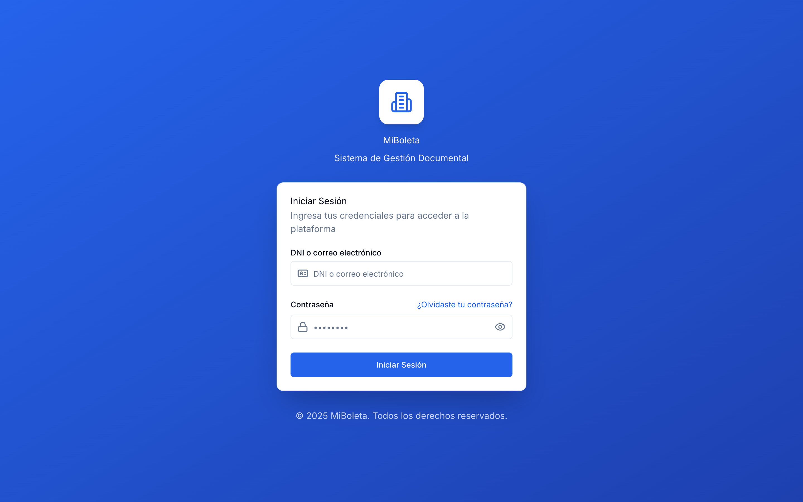

**Descripción:**
La página de login proporciona acceso seguro al sistema mediante credenciales de usuario.

**Elementos de la interfaz:**

| Elemento                                       | Descripción                                 |
| ---------------------------------------------- | -------------------------------------------- |
| **Logo MiBoleta**                        | Identidad visual del sistema                 |
| **Campo "DNI o correo electrónico"**   | Acepta **cualquiera de los dos**: el DNI del trabajador o su correo |
| **Campo Contraseña**                    | Entrada segura con opción mostrar/ocultar   |
| **Botón "Iniciar Sesión"**             | Ejecuta la autenticación                    |
| **Enlace "¿Olvidaste tu contraseña?"** | Inicia flujo de recuperación                |
| **Pie de página**                       | Información legal y copyright               |

**Flujo de autenticación:**

1. La persona ingresa su **DNI o su correo** y la contraseña. Se admiten los dos
   porque muchos trabajadores no tienen correo corporativo y sí recuerdan su
   documento.
2. El sistema valida las credenciales.
3. Si son válidas, entra al panel que corresponde a su rol.
4. Si son inválidas, muestra un mensaje de error.

**Primer ingreso y cambio obligatorio de contraseña.** Cuando se crea una
cuenta —o cuando un administrador restablece la contraseña— la cuenta queda
marcada para cambio obligatorio. En el siguiente ingreso, el sistema lleva
directamente a la pantalla de cambio de contraseña y no permite continuar hasta
que se defina una nueva.

**Si pertenece a varias empresas.** Al entrar se opera siempre dentro de una
empresa concreta. Si la persona pertenece a más de una, en la barra superior
aparece un selector de empresa y, si además tiene roles distintos en ellas, otro
selector de rol. Lo que se ve y lo que se puede hacer depende de esa
combinación: la misma persona puede ser Admin Empleados en una empresa y
Empleado en otra.

---

# PARTE I: ROL ROOT (Super Administrador)

---

## 2. Panel de Root (Super Administrador)

### 2.1 Dashboard de Root (Parte Superior)

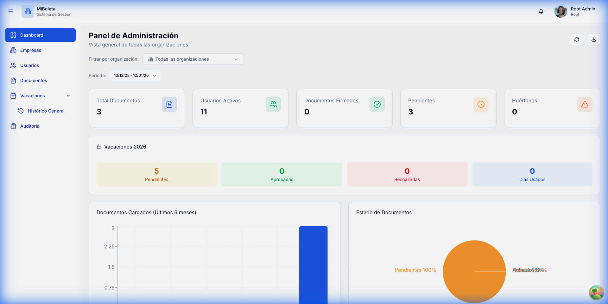

**Descripción:**
El dashboard de Root proporciona una vista global de todas las organizaciones del sistema, con acceso a funciones de administración multi-tenant.

**Métricas principales:**

| Métrica                     | Descripción                       |
| ---------------------------- | ---------------------------------- |
| **Total Documentos**   | Documentos en todas las empresas   |
| **Usuarios Activos**   | Total de usuarios del sistema      |
| **Documentos Firmados** | Documentos con firma completada    |
| **Pendientes**         | Documentos sin firmar              |
| **Huérfanos**         | Documentos sin usuario asignado    |

**Panel de Vacaciones 2026:**
- Pendientes de aprobación
- Aprobadas
- Rechazadas
- Días usados

**Gráficos:**
- Documentos cargados por mes (últimos 6 meses)
- Estado de documentos (circular)

### 2.2 Dashboard de Root (Parte Inferior)

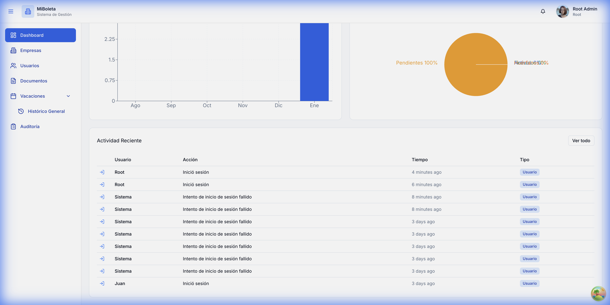

**Tabla de Actividad Reciente:**
Muestra las últimas acciones realizadas en el sistema por todos los usuarios.

| Columna        | Contenido                    |
| -------------- | ----------------------------- |
| **Usuario** | Nombre del usuario que actuó |
| **Acción** | Tipo de actividad             |
| **Tiempo**  | Hace cuánto ocurrió        |
| **Tipo**    | Categoría del evento        |

**Diferencias con Admin:**

| Característica                   | Root                     | Admin                 |
| ---------------------------------- | ------------------------ | --------------------- |
| **Alcance**                  | Todas las organizaciones | Solo su organización |
| **Crear empresas**           | Sí                      | No                    |
| **Crear usuarios globales**  | Sí                      | Solo de su empresa    |
| **Filtro por organización** | Sí                      | No                    |

**Secciones del sidebar exclusivas de Root:**

| Sección            | Función                         |
| -------------------- | -------------------------------- |
| **Empresas**   | Crear y gestionar organizaciones |
| **Usuarios**   | Gestión global de usuarios      |
| **Documentos** | Vista global de documentos       |
| **Auditoría** | Logs de todo el sistema          |

**Filtro de organización:**
Root puede filtrar toda la información por organización específica o ver "Todas las organizaciones" simultáneamente.

---

## 3. Gestión de Empresas (Rol: Root)

### 3.1 Lista de Empresas

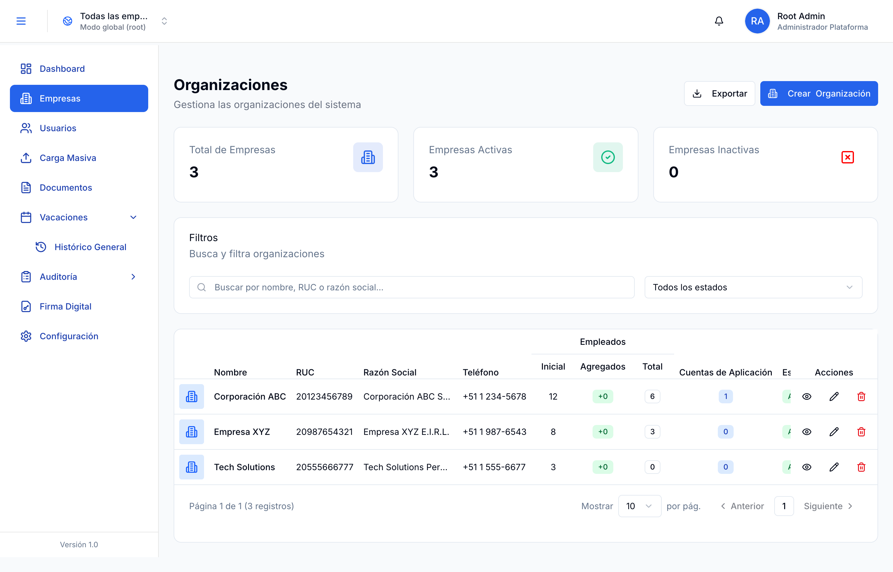

**Descripción:**
Permite al Root visualizar y gestionar todas las organizaciones registradas en el sistema.

**Cards de métricas:**

| Métrica            | Descripción                   |
| ------------------- | ------------------------------ |
| **Total**     | Organizaciones registradas     |
| **Activas**   | Empresas con acceso habilitado |
| **Inactivas** | Empresas deshabilitadas        |

**Columnas de la tabla:**

| Columna                 | Contenido                          |
| ----------------------- | ---------------------------------- |
| **RUC**           | Identificador fiscal de la empresa |
| **Razón Social** | Nombre legal de la empresa         |
| **Teléfono**     | Contacto de la empresa             |
| **Estado**        | Badge (Activo/Inactivo)            |
| **Acciones**      | Editar, Desactivar                 |

### 3.2 Formulario de Nueva Empresa (Parte Superior)

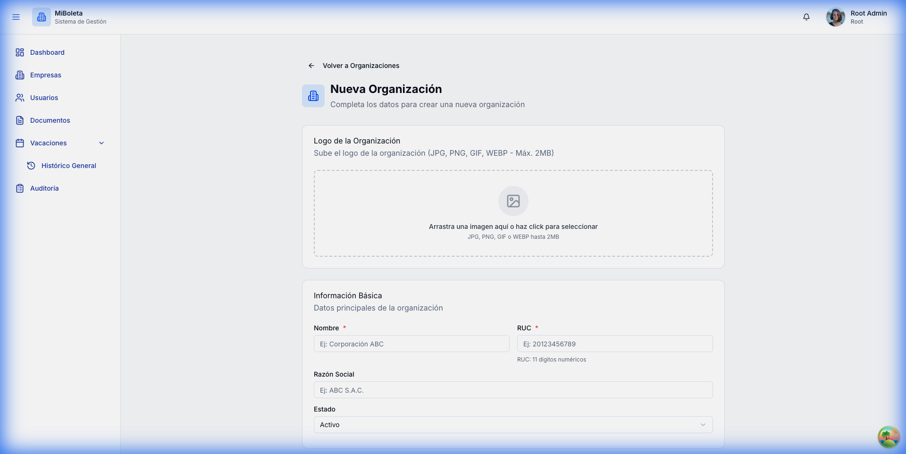

**Descripción:**
Formulario para crear una nueva organización en el sistema.

**Sección Logo:**

| Campo                        | Tipo   | Descripción                                  |
| ---------------------------- | ------ | --------------------------------------------- |
| **Logo de la Organización** | Imagen | Zona drag-and-drop (JPG, PNG, GIF, WEBP 2MB) |

**Sección Información Básica:**

| Campo              | Tipo   | Requerido | Descripción                    |
| ------------------ | ------ | --------- | ------------------------------- |
| **Nombre**   | Text   | Sí       | Nombre de la organización      |
| **RUC**      | Text   | Sí       | Identificador fiscal (11 dígitos) |
| **Razón Social** | Text | No       | Nombre legal de la empresa      |
| **Estado**   | Select | Sí       | Activo / Inactivo               |

### 3.3 Formulario de Nueva Empresa (Parte Inferior)

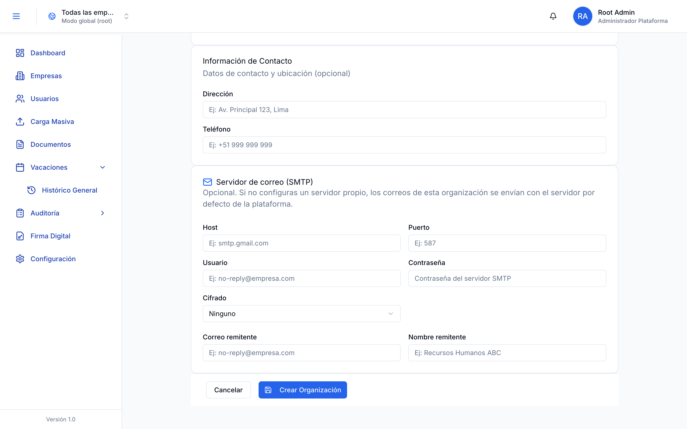

**Sección Información de Contacto:**

| Campo              | Tipo | Requerido | Descripción           |
| ------------------ | ---- | --------- | ---------------------- |
| **Dirección** | Text | No        | Dirección física    |
| **Teléfono**  | Text | No        | Número de contacto   |

**Botones de acción:**

| Botón                    | Función                           |
| -------------------------- | ---------------------------------- |
| **Cancelar**         | Descarta los cambios y regresa     |
| **Crear Organización** | Guarda la nueva empresa en el sistema |

**Flujo de creación:**

1. Root accede a Empresas > "+ Organización"
2. Opcionalmente sube logo de la empresa
3. Completa información básica (Nombre, RUC)
4. Completa información de contacto (opcional)
5. Clic en "Crear Organización"
6. La empresa queda disponible para asignar usuarios

---

## 4. Gestión Global de Usuarios (Rol: Root)

### 4.1 Lista de Usuarios

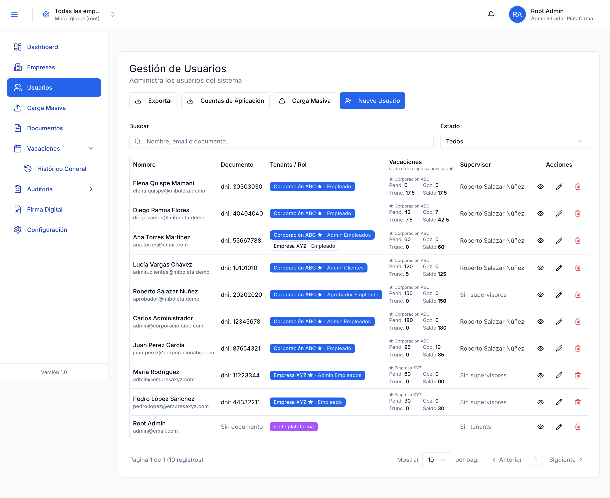

**Descripción:**
Vista global de todos los usuarios del sistema, con capacidad de filtrar por organización.

**Filtros disponibles:**

| Filtro                  | Función                |
| ----------------------- | ----------------------- |
| **Buscar**        | Por nombre, email o DNI |
| **Organización** | Filtrar por empresa     |
| **Rol**           | Root, Admin, Usuario    |
| **Estado**        | Activo / Inactivo       |

**Columnas de la tabla:**

| Columna              | Contenido                |
| -------------------- | ------------------------ |
| **Nombre**     | Nombre completo + email  |
| **Documento**  | DNI del usuario          |
| **Rol**        | Badge de rol             |
| **Tenants**    | Organizaciones asignadas |
| **Supervisor** | Jefe inmediato asignado  |
| **Estado**     | Activo / Inactivo        |
| **Acciones**   | Editar, Ver              |

### 4.2 Formulario de Nuevo Usuario (Parte Superior)

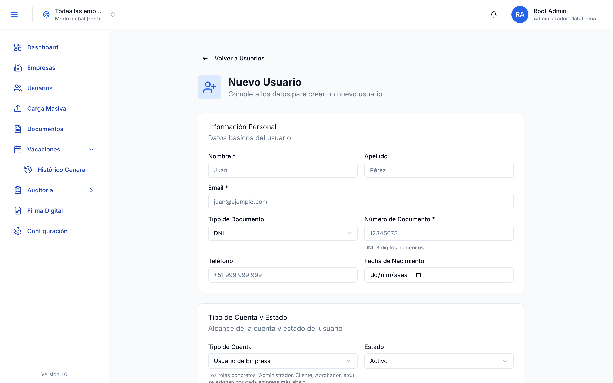

**Descripción:**
Sección superior del formulario para crear un nuevo usuario.

**Campos de información personal:**

| Campo                          | Tipo   | Requerido | Descripción                |
| ------------------------------ | ------ | --------- | --------------------------- |
| **Nombre**               | Text   | Sí       | Nombre del usuario          |
| **Apellido**             | Text   | Sí       | Apellido del usuario        |
| **Email**                | Email  | Sí       | Correo electrónico (login) |
| **Tipo de Documento**    | Select | Sí       | DNI, Pasaporte, etc.        |
| **Número de Documento** | Text   | Sí       | Número del documento       |
| **Teléfono**            | Text   | No        | Número de contacto         |

### 4.3 Formulario de Nuevo Usuario (Parte Inferior)

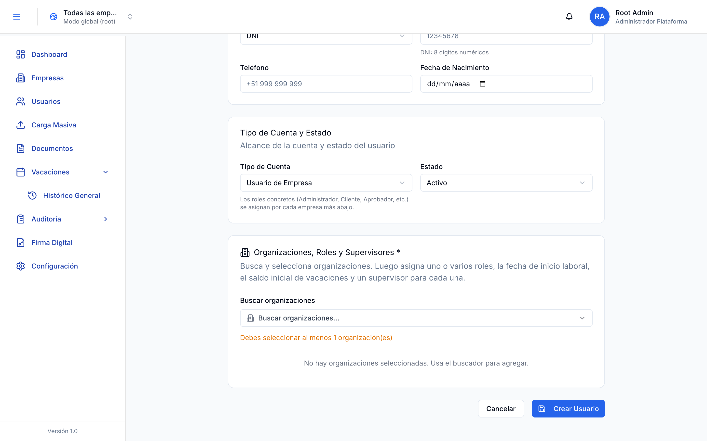

**Descripción:**
Sección inferior del formulario con configuración de rol, estado y asignación a organizaciones.

**Campos de configuración:**

| Campo                    | Tipo         | Descripción                 |
| ------------------------ | ------------ | ---------------------------- |
| **Rol**            | Select       | Root, Admin, Usuario         |
| **Estado**         | Select       | Activo / Inactivo            |
| **Organizaciones** | Multi-select | Empresas a las que pertenece |

**Asignación de Supervisor por Empresa:**

Al seleccionar una organización para el usuario, aparece un campo adicional para asignar el **supervisor** de ese usuario **específicamente para esa empresa**. Esto permite:

- Un usuario puede pertenecer a múltiples empresas
- Cada empresa puede tener un supervisor diferente para el mismo usuario
- El supervisor aprueba las vacaciones del usuario en esa organización

**Proceso de creación de usuario:**

1. Root accede a Usuarios > "+ Nuevo Usuario"
2. Completa información personal (nombre, email, DNI)
3. Selecciona el rol (Admin o Usuario)
4. Establece el estado (Activo por defecto)
5. Busca y selecciona las organizaciones
6. Para cada organización, asigna el supervisor correspondiente
7. Guarda el usuario
8. El usuario recibe email para establecer su contraseña

**Gestión de contraseñas:**

El sistema utiliza un flujo de invitación por email:

- Al crear un usuario, se envía automáticamente un correo
- El usuario establece su contraseña mediante el enlace recibido
- Para restablecer contraseña: el usuario usa "¿Olvidaste tu contraseña?"
- Root/Admin puede forzar un restablecimiento desde el panel

**Desactivar un usuario:**

1. Ir a la lista de usuarios
2. Clic en "Editar" del usuario
3. Cambiar Estado a "Inactivo"
4. Guardar cambios
5. El usuario no podrá iniciar sesión

---

## 4bis. Carga Masiva de Usuarios

**Quién puede hacerlo:** Super Administrador y Admin Clientes.

Da de alta a muchas personas de una sola vez a partir de un archivo, en lugar
de crearlas una por una. Está pensado para el arranque de una empresa nueva o
para incorporaciones grandes.

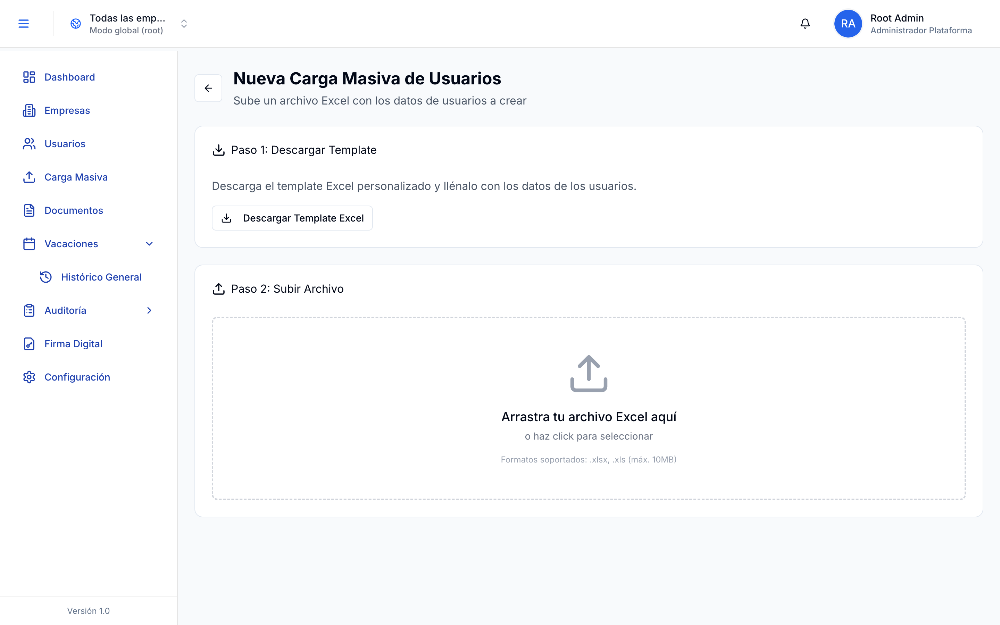

### 4bis.1 Formato del archivo

Se descarga una **plantilla** desde la propia pantalla; conviene partir siempre
de ella porque las columnas deben llamarse exactamente igual.

La regla que más confusión genera: **una fila por cada combinación de persona y
empresa**. Si alguien trabaja en dos empresas, van dos filas con el mismo DNI y
distinta empresa. El sistema las agrupa por DNI y crea **una sola cuenta** con
dos vínculos laborales, cada uno con su propia fecha de ingreso, área, cargo,
supervisor y saldo inicial de vacaciones.

Esto importa porque las vacaciones se calculan **por empresa**: la misma persona
puede llevar tres años en una y seis meses en otra, y su saldo es distinto en
cada una.

### 4bis.2 Cómo funciona el proceso

1. Se sube el archivo y el sistema lo **valida sin guardar nada**: revisa
   formato, DNIs repetidos, empresas inexistentes y campos obligatorios.
2. Se muestra una vista previa con los errores detectados, fila por fila. Si hay
   errores, se corrige el archivo y se vuelve a subir.
3. Al confirmar, la carga se procesa **en segundo plano**. La pantalla no se
   queda bloqueada: se puede cerrar y volver más tarde.
4. El lote queda registrado con su estado (pendiente, procesando, completado,
   completado con errores o fallido) y el detalle de qué filas entraron y cuáles
   no, con el motivo.
5. Si alguna fila falló, se descarga un archivo con **solo esas filas** y su
   error, para corregirlo y reintentar sin tocar las que sí entraron.

> Las personas creadas reciben una contraseña temporal y el sistema les exige
> cambiarla en su primer ingreso.

---

# PARTE II: ROL ADMIN (Administrador de Organización)

---

## 5. Panel de Administrador

### 5.1 Dashboard de Administrador

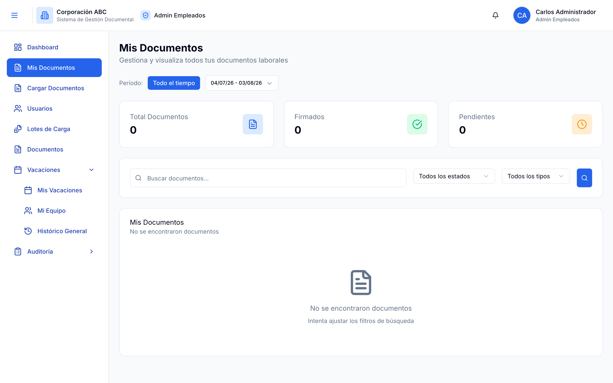

**Descripción:**
Vista principal del administrador con métricas globales de la organización.

**Secciones del sidebar:**

| Sección                     | Función                   |
| ---------------------------- | -------------------------- |
| **Dashboard**          | Vista principal            |
| **Cargar Documentos**  | Carga masiva ZIP           |
| **Usuarios**           | Gestión de empleados      |
| **Lotes de Carga**     | Historial de cargas        |
| **Documentos**         | Buscador de documentos     |
| **Auditoría**         | Registro de actividad      |
| **Mi Equipo**          | Vacaciones de subordinados |
| **Histórico General** | Todas las vacaciones       |

**Métricas principales:**

| Métrica                      | Descripción                    |
| ----------------------------- | ------------------------------- |
| **Total Documentos**    | Cantidad total cargados         |
| **Usuarios Activos**    | Empleados en la organización   |
| **Documentos Firmados** | Porcentaje de cumplimiento      |
| **Pendientes**          | Documentos sin firmar           |
| **Huérfanos**          | Documentos sin usuario asignado |

**Gráficos:**

- **Documentos Cargados:** Barras por mes (últimos 6 meses)
- **Estado de Documentos:** Gráfico circular (firmados vs pendientes)

**Panel de Vacaciones:**

- Solicitudes pendientes, aprobadas, rechazadas
- Días consumidos por la organización

---

## 6. Carga Masiva de Documentos

### 6.1 Interfaz de Carga (Estado Inicial)

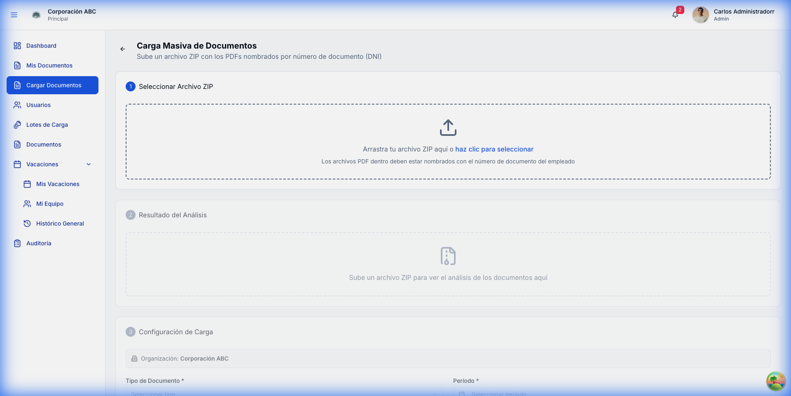

**Descripción:**
Permite al administrador cargar múltiples documentos simultáneamente mediante un archivo ZIP.

**Secciones de la interfaz:**

| Sección                       | Descripción                              |
| ------------------------------ | ----------------------------------------- |
| **Seleccionar Archivo ZIP** | Zona drag-and-drop para subir el archivo |
| **Resultado del Análisis** | Muestra el resultado una vez procesado   |
| **Configuración de Carga** | Tipo de documento y período             |

**Paso 1 - Seleccionar Archivo ZIP:**

- Zona de drag-and-drop
- Requisito: archivo ZIP conteniendo PDFs
- Los PDFs deben estar nombrados con el DNI del empleado

### 6.2 Interfaz de Carga (Con Archivo Procesado)

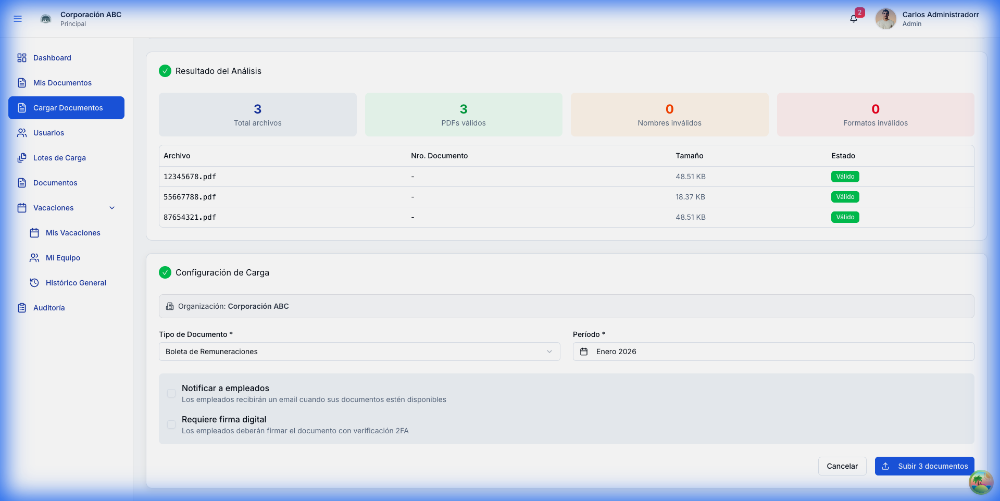

**Descripción:**
Una vez subido el archivo ZIP, el sistema analiza su contenido y muestra los resultados.

**Resultado del Análisis:**

| Métrica               | Descripción                        |
| ---------------------- | ----------------------------------- |
| **Total archivos** | Cantidad de archivos en el ZIP      |
| **PDFs válidos**  | Archivos con formato correcto       |
| **Nombres inválidos** | Archivos con nombre incorrecto   |
| **Formatos inválidos** | Archivos que no son PDF         |

**Lista de archivos:**

| Columna         | Contenido                    |
| --------------- | ----------------------------- |
| **Archivo** | Nombre del PDF                |
| **Nro. Documento** | DNI extraído del nombre |
| **Tamaño** | Peso del archivo              |
| **Estado** | Badge verde (válido) o rojo (error) |

**Configuración de Carga:**

| Campo                      | Descripción                       |
| --------------------------- | ---------------------------------- |
| **Organización**     | Empresa destino (auto-seleccionada) |
| **Tipo de Documento** | Boleta, Contrato, Liquidación, etc. |
| **Período**          | Mes y año del documento           |

**Opciones adicionales:**

- **Notificar a empleados:** Envía email cuando estén disponibles
- **Requiere firma digital:** Activa flujo de firma 2FA

**Estructura esperada del ZIP:**

```
carga_documentos.zip
├── 12345678.pdf    → Empleado con DNI 12345678
├── 87654321.pdf    → Empleado con DNI 87654321
└── 55667788.pdf    → Empleado con DNI 55667788
```

---

## 7. Lotes de Carga

### 7.1 Historial de Lotes

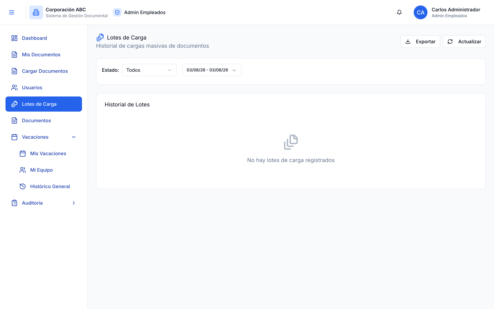

**Descripción:**
Vista que muestra el historial de todas las cargas masivas realizadas, permitiendo consultar el estado y detalle de cada lote.

**Cards de métricas:**

| Métrica               | Descripción                    |
| ---------------------- | ------------------------------- |
| **Total Lotes**  | Cantidad de cargas realizadas   |
| **Exitosos**     | Lotes procesados correctamente  |
| **Con Errores**  | Lotes con documentos fallidos   |
| **En Proceso**   | Lotes en cola de procesamiento  |

**Columnas de la tabla:**

| Columna                      | Contenido                          |
| ----------------------------- | ---------------------------------- |
| **ID Lote**            | Identificador único del lote      |
| **Fecha de Carga**      | Timestamp de creación             |
| **Total Documentos**    | Cantidad de PDFs en el lote        |
| **Asignados**           | Documentos vinculados a empleados  |
| **Huérfanos**          | Documentos sin coincidencia de DNI |
| **Estado**              | Badge (Procesado, Error, Pendiente)|
| **Acciones**            | Ver detalle, Descargar reporte     |

### 7.2 Detalle de Lote (Parte Superior)

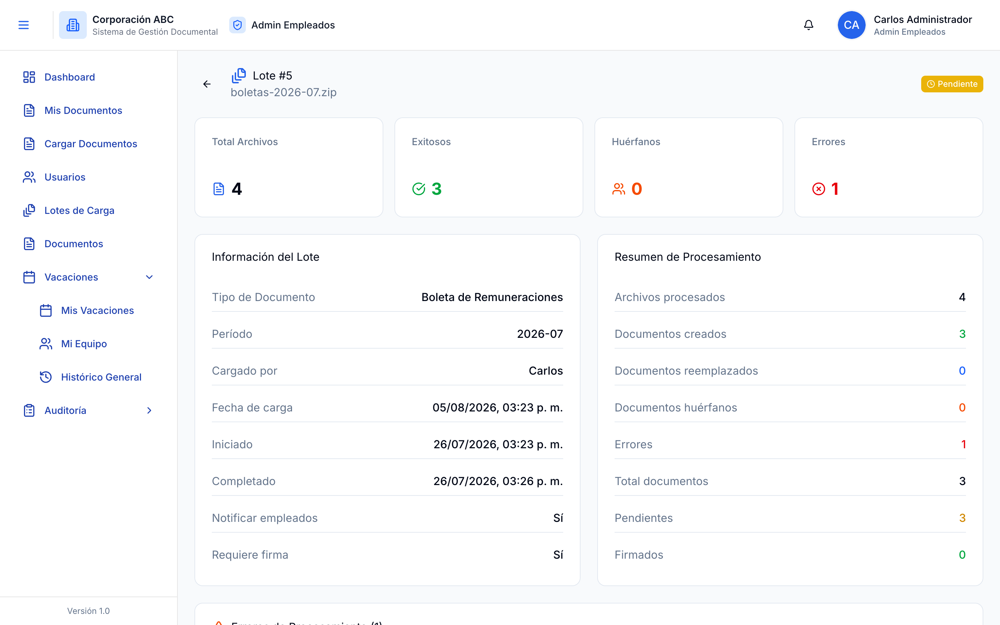

**Descripción:**
Vista detallada de un lote específico mostrando información general y métricas de procesamiento.

**Cards de métricas:**

| Métrica              | Descripción                    |
| --------------------- | ------------------------------- |
| **Total Archivos** | Cantidad de PDFs procesados     |
| **Exitosos**      | Documentos cargados correctamente |
| **Huérfanos**    | Sin coincidencia de DNI         |
| **Errores**       | Documentos con problemas        |

**Información del lote:**

| Campo                     | Contenido                             |
| ------------------------- | -------------------------------------- |
| **Tipo de Documento** | Categoría asignada (Boleta, Contrato) |
| **Período**         | Mes y año del documento               |
| **Cargado por**       | Administrador que realizó la carga   |
| **Fecha de carga**    | Timestamp de creación                |
| **Iniciado**          | Inicio del procesamiento              |
| **Completado**        | Fin del procesamiento                 |

**Resumen de Procesamiento:**

| Campo                          | Valor                |
| ------------------------------- | -------------------- |
| **Archivos procesados**   | Cantidad procesada    |
| **Documentos creados**    | Nuevos documentos     |
| **Documentos reemplazados** | Actualizados        |
| **Documentos huérfanos** | Sin usuario asignado |
| **Total documentos**      | Total en el lote      |
| **Pendientes**            | Sin firma             |
| **Firmados**              | Con firma completada  |

### 7.3 Detalle de Lote (Lista de Documentos)

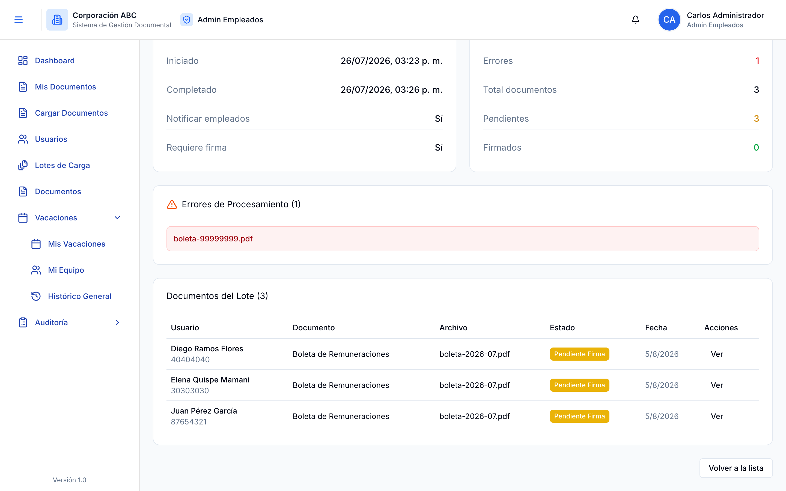

**Descripción:**
Lista de todos los documentos cargados en el lote con sus estados individuales.

**Columnas de la tabla:**

| Columna           | Contenido                       |
| ------------------ | ------------------------------- |
| **Usuario**   | Nombre del empleado asignado    |
| **Documento** | Tipo de documento               |
| **Archivo**   | Nombre del PDF                  |
| **Estado**    | Badge (Pendiente Firma/Firmado) |
| **Fecha**     | Fecha de carga                  |
| **Acciones**  | Botón "Ver" documento          |

### 7.4 Vista de Documento desde el Lote

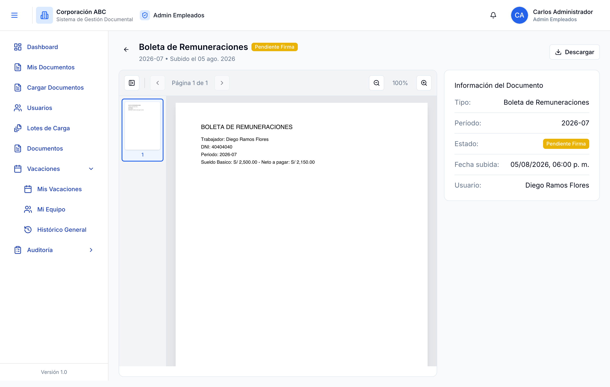

**Descripción:**
Al hacer clic en "Ver" desde la lista de documentos del lote, se abre el visor de documento con toda la información.

**Componentes del visor:**

| Componente                  | Función                                  |
| ---------------------------- | ----------------------------------------- |
| **Visor PDF**          | Renderiza el documento embebido           |
| **Miniaturas**          | Navegación rápida entre páginas        |
| **Panel de información** | Tipo, período, estado, fecha de subida |
| **Firma Digital**        | Botón para iniciar proceso de firma    |

**Acciones disponibles:**

- **Firmar Documento**: Inicia el flujo de firma 2FA (solo para pendientes)
- **Descargar**: Obtiene copia del documento
- **Volver**: Regresa a la lista de documentos del lote

---

## 8. Gestión de Usuarios (Admin)

### 8.1 Lista de Usuarios

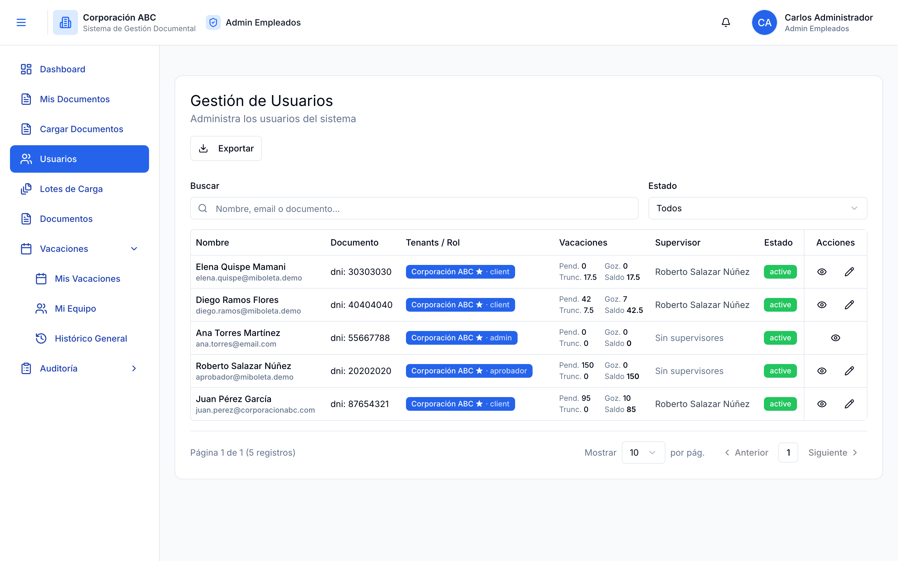

**Descripción:**
Permite visualizar, buscar y gestionar los usuarios de la organización.

**Filtros disponibles:**

| Filtro                  | Función                 |
| ----------------------- | ------------------------ |
| **Buscador**      | Por nombre, email o DNI  |
| **Organización** | Filtrar por tenant       |
| **Estado**        | Activo / Inactivo        |
| **Exportar**      | Descargar lista en Excel |

**Columnas de la tabla:**

| Columna              | Contenido                    |
| -------------------- | ---------------------------- |
| **Nombre**     | Nombre completo + email      |
| **Documento**  | DNI del empleado             |
| **Rol**        | Badge de rol (admin, client) |
| **Tenants**    | Organización asignada       |
| **Supervisor** | Supervisor directo           |
| **Estado**     | Badge de estado              |
| **Acciones**   | Ver perfil                   |

---

## 9. Buscador de Documentos

### 9.1 Lista de Documentos

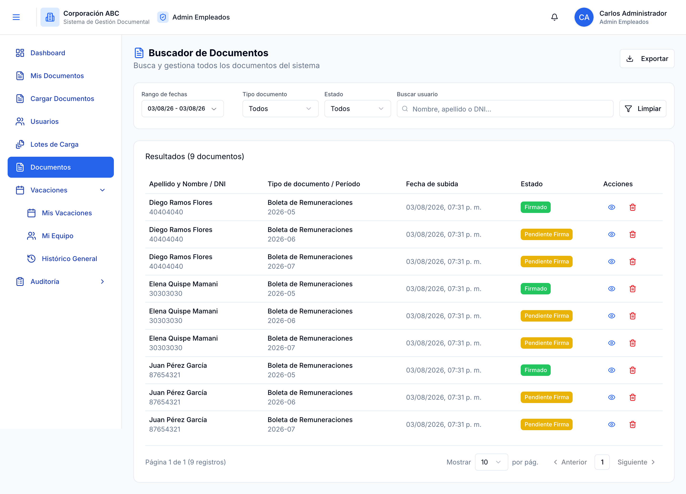

**Descripción:**
Permite al administrador buscar y gestionar todos los documentos de la organización.

**Filtros disponibles:**

| Filtro                      | Función            |
| --------------------------- | ------------------- |
| **Rango de fechas**   | Fecha de carga      |
| **Tipo de documento** | Categoría          |
| **Estado**            | Firmado / Pendiente |
| **Buscar usuario**    | Por nombre o DNI    |

**Columnas de la tabla:**

| Columna                   | Contenido               |
| ------------------------- | ----------------------- |
| **Apellido/Nombre** | Empleado asignado + DNI |
| **Tipo/Período**   | Categoría y mes/año   |
| **Fecha de subida** | Timestamp de carga      |
| **Estado**          | Badge de firma          |
| **Acciones**        | Ver, Eliminar           |

**Funcionalidades:**

- Exportar listado
- Limpiar filtros
- Paginación configurable

---

## 10. Registro de Auditoría

### 10.1 Log de Actividad

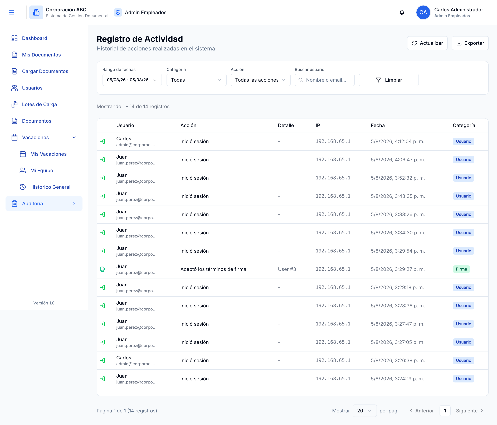

**Descripción:**
Registro completo de todas las acciones realizadas en el sistema para cumplimiento y seguridad.

**Eventos rastreados:**

| Evento                                 | Descripción             |
| -------------------------------------- | ------------------------ |
| **Inició sesión**              | Login de usuario         |
| **Cerró sesión**               | Logout de usuario        |
| **Documento firmado**            | Firma completada         |
| **Documento cargado**            | Nueva carga de documento |
| **Usuario creado**               | Alta de empleado         |
| **Vacación solicitada**         | Nueva solicitud          |
| **Vacación aprobada/rechazada** | Decisión de supervisor  |

**Columnas del log:**

| Columna              | Contenido                        |
| -------------------- | -------------------------------- |
| **Usuario**    | Nombre + email                   |
| **Acción**    | Tipo de evento                   |
| **Detalle**    | Información adicional           |
| **IP**         | Dirección de origen             |
| **Fecha**      | Timestamp exacto                 |
| **Categoría** | Usuario / Documento / Vacaciones |

**Filtros:**

- Rango de fechas
- Categoría
- Tipo de acción
- Usuario específico

---

## 11. Gestión de Vacaciones del Equipo

### 11.1 Vista General

**Descripción:**
Permite al supervisor gestionar las solicitudes de vacaciones de sus subordinados directos. La interfaz está organizada en 4 pestañas para facilitar la gestión según el estado de cada solicitud.

**Cards de métricas:**

| Métrica               | Descripción                      |
| ----------------------- | --------------------------------- |
| **Pendientes**    | Solicitudes por aprobar           |
| **Por Confirmar** | Vacaciones aprobadas sin confirmar |
| **Mi Historial**  | Solicitudes procesadas            |
| **Calendario**    | Vista visual de eventos           |

---

### 11.2 Pestaña: Pendientes

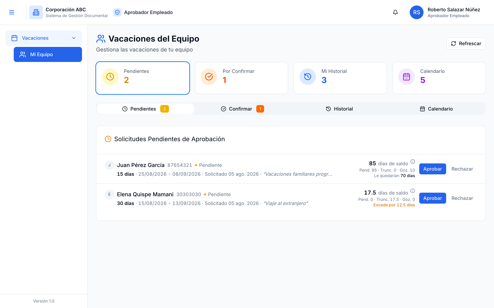

**Descripción:**
Lista de solicitudes de vacaciones que están pendientes de aprobación por parte del supervisor.

**Información mostrada:**

| Campo                | Descripción                        |
| -------------------- | ----------------------------------- |
| **Empleado**   | Nombre y documento del solicitante  |
| **Estado**     | Punto de color y etiqueta del estado |
| **Duración**  | Días solicitados, destacados        |
| **Fechas**     | Rango de inicio a fin               |
| **Solicitado** | Fecha de creación de la solicitud |
| **Motivo**     | Razón proporcionada por el empleado |
| **Saldo del solicitante** | Sus cuatro cifras de vacaciones y el efecto de aprobar |

#### El saldo del solicitante, en la propia fila

Cada solicitud muestra a la derecha el saldo de quien la pide, **en la empresa
de esa solicitud**, con el desglose de los tres conceptos que lo componen y una
línea de conclusión:

- **Le quedarían X días** cuando el saldo alcanza.
- **Excede por X días**, en ámbar y con la fila entera resaltada, cuando lo
  solicitado supera el saldo.

Esto existe porque el saldo puede cambiar entre el momento en que se solicita y
el momento en que se aprueba: si mientras tanto se aprobaron otras vacaciones,
el saldo bajó. La cifra que se muestra es la del momento en que se abre la
pantalla.

> **Importante:** el aviso de exceso **no bloquea** la aprobación. Es
> información para decidir, no una restricción: la decisión sigue siendo del
> aprobador.

**Acciones disponibles:**

- **Aprobar:** Concede las vacaciones solicitadas
- **Rechazar:** Deniega la solicitud (requiere ingresar motivo)

---

### 11.3 Pestaña: Por Confirmar

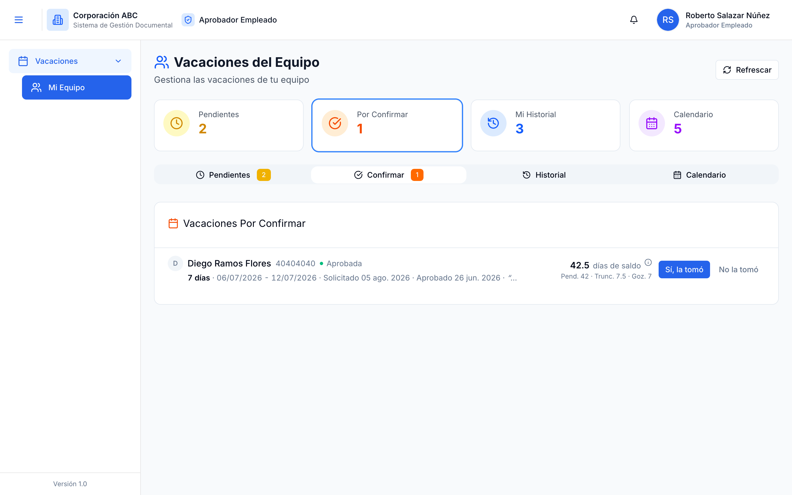

**Descripción:**
Lista de vacaciones que ya fueron aprobadas pero el período ya pasó y se debe confirmar si el empleado las tomó efectivamente.

**Información mostrada:**

| Campo                | Descripción                   |
| -------------------- | ------------------------------ |
| **Empleado**   | Nombre del empleado            |
| **Estado**     | Badge "Aprobada"               |
| **Fechas**     | Rango de las vacaciones        |
| **Días**      | Cantidad de días              |
| **Solicitado** | Fecha de la solicitud          |
| **Aprobado**   | Fecha de aprobación           |

**Acciones disponibles:**

- **Sí, la tomó:** Confirma que el empleado gozó las vacaciones
- **No la tomó:** Indica que el empleado no tomó las vacaciones

---

### 11.4 Pestaña: Historial

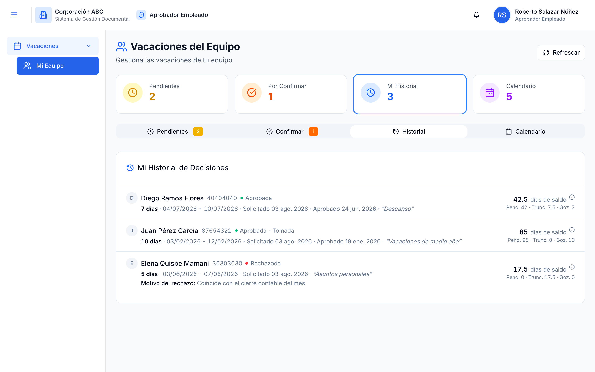

**Descripción:**
Registro histórico de todas las decisiones tomadas por el supervisor sobre las solicitudes de su equipo.

**Información mostrada:**

| Campo                | Descripción                     |
| -------------------- | -------------------------------- |
| **Empleado**   | Nombre y documento               |
| **Estado**     | Badge (Aprobada, Rechazada)      |
| **Fechas**     | Rango de vacaciones              |
| **Días**      | Cantidad de días               |
| **Solicitado** | Fecha de creación              |
| **Aprobado**   | Fecha y responsable de decisión |

---

### 11.5 Pestaña: Calendario

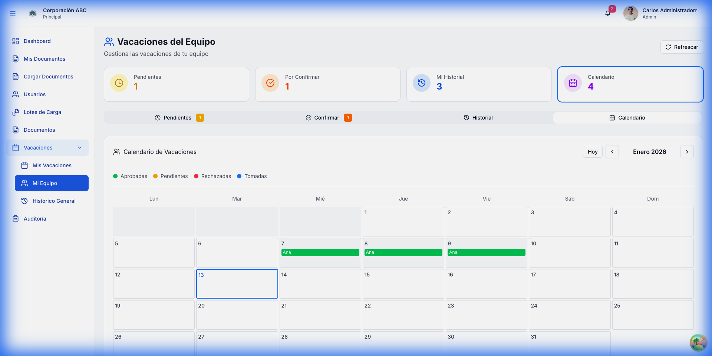

**Descripción:**
Vista de calendario mensual que muestra de forma visual todas las vacaciones programadas, aprobadas y tomadas del equipo.

**Leyenda de colores:**

| Color           | Significado                      |
| --------------- | --------------------------------- |
| **Verde** | Vacaciones aprobadas/tomadas      |
| **Amarillo** | Vacaciones pendientes de aprobación |
| **Rojo**  | Vacaciones rechazadas             |
| **Gris**  | Días no laborables               |

**Funcionalidades:**

- Navegación por meses (anterior/siguiente)
- Ir a fecha actual (botón "Hoy")
- Visualización de eventos por día
- Click en evento para ver detalle

---

## 12. Histórico General de Vacaciones

### 12.1 Histórico Completo

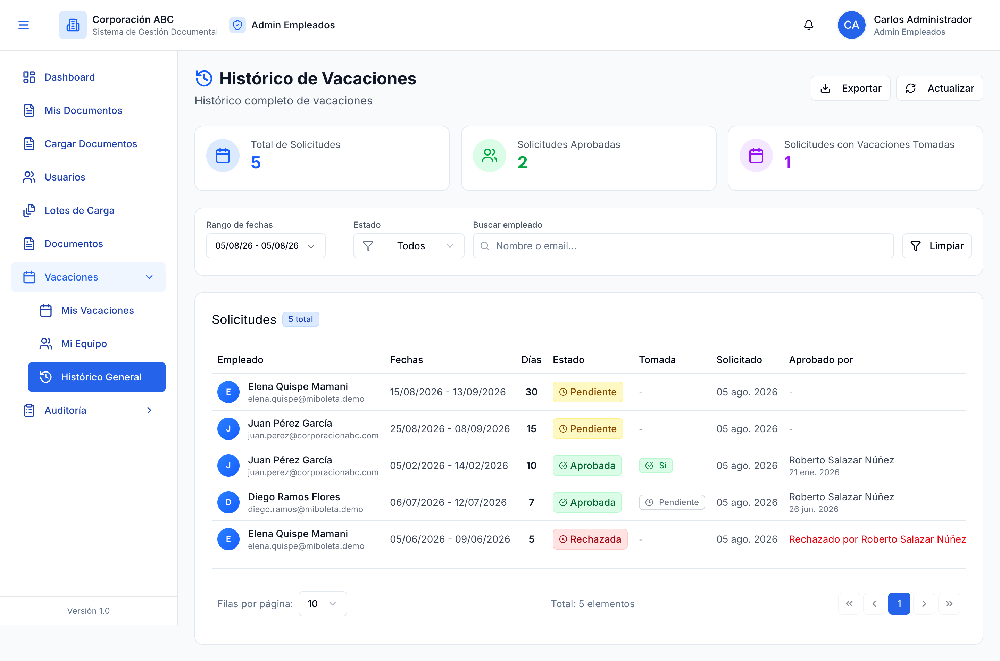

**Descripción:**
Vista centralizada de todas las solicitudes de vacaciones de la organización.

**Cards de métricas:**

| Métrica                    | Descripción           |
| --------------------------- | ---------------------- |
| **Total Solicitudes** | Todas las solicitudes  |
| **Aprobadas**         | Solicitudes concedidas |
| **Tomadas**           | Vacaciones ya gozadas  |

**Columnas de la tabla:**

| Columna                | Contenido                  |
| ---------------------- | -------------------------- |
| **Empleado**     | Nombre + email + iniciales |
| **Fechas**       | Rango de vacaciones        |
| **Días**        | Cantidad de días          |
| **Estado**       | Badge de estado            |
| **Tomada**       | Si ya fue gozada           |
| **Solicitado**   | Fecha de creación         |
| **Aprobado por** | Supervisor + fecha         |

**Funcionalidades:**

- Exportar a Excel
- Filtrar por fechas, estado, empleado
- Actualizar listado

---

# PARTE III: ROL CLIENT (Empleado)

---

## 13. Dashboard de Empleado (Rol: Client)

### 13.1 Vista Principal del Empleado

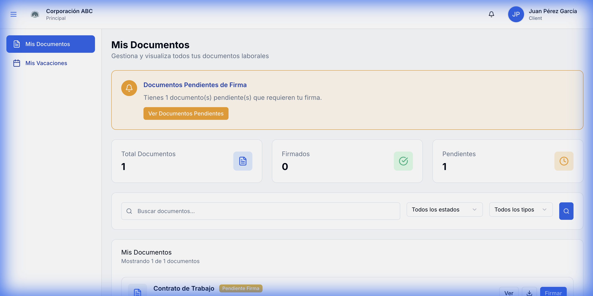

**Descripción:**
El dashboard del empleado presenta un resumen de sus documentos pendientes y firmados, con acceso directo a visualización y firma.

**Secciones principales:**

| Sección                      | Contenido                                           |
| ----------------------------- | --------------------------------------------------- |
| **Sidebar**             | Navegación: Inicio, Mis Documentos, Mis Vacaciones |
| **Encabezado**          | Bienvenida personalizada con nombre del usuario     |
| **Cards de Métricas**  | Total documentos, Firmados, Pendientes              |
| **Filtros**             | Buscador, tipo de documento, estado                 |
| **Lista de Documentos** | Tarjetas con información de cada documento         |

**Información por documento:**

| Campo                          | Descripción                                |
| ------------------------------ | ------------------------------------------- |
| **Tipo**                 | Categoría (Contrato, Boleta, Liquidación) |
| **Período**             | Mes y año correspondiente                  |
| **Estado**               | Badge visual (Pendiente Firma / Firmado)    |
| **Fecha de asignación** | Cuándo fue cargado                         |
| **Fecha de firma**       | Cuándo fue firmado (si aplica)             |
| **Acciones**             | Ver documento, Firmar (si pendiente)        |

---

## 14. Visor de Documentos

### 14.1 Visualización de Documento PDF

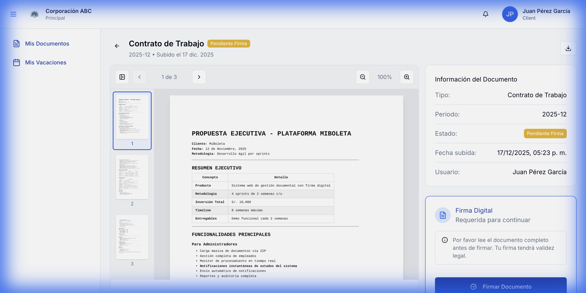

**Descripción:**
El visor de documentos permite al empleado revisar el contenido completo del documento en formato PDF antes de firmarlo.

**Componentes:**

| Componente                           | Función                                               |
| ------------------------------------ | ------------------------------------------------------ |
| **Breadcrumb**                 | Navegación: Inicio > Documento                        |
| **Área de visualización**    | Renderizado del PDF embebido                           |
| **Información del documento** | Tipo, período, fecha de carga                         |
| **Estado**                     | Indicador visual del estado de firma                   |
| **Botón "Firmar Documento"**  | Inicia el proceso de firma (visible solo si pendiente) |
| **Botón "Descargar"**         | Obtiene copia del documento                            |
| **Botón "Volver"**            | Regresa al dashboard                                   |

---

## 15. Proceso de Firma Digital

### 15.1 Modal de Verificación en Dos Pasos (Paso 1)

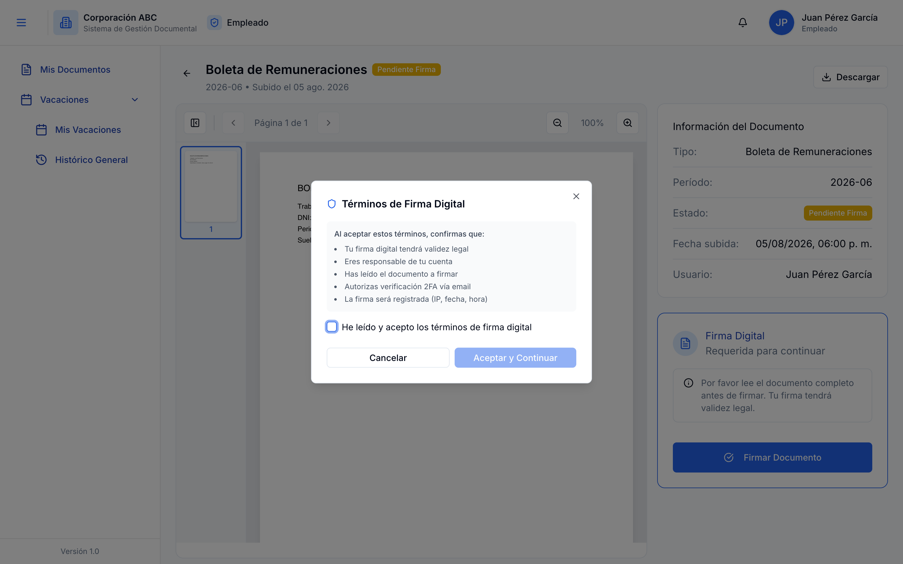

**Descripción:**
El primer paso del proceso de firma solicita al usuario confirmar que desea firmar y envía un código de verificación a su correo electrónico.

**Contenido del modal:**

| Elemento                          | Descripción                           |
| --------------------------------- | -------------------------------------- |
| **Título**                 | "Verificación en Dos Pasos"           |
| **Documento a firmar**      | Nombre y período del documento        |
| **Descripción**            | Explicación del proceso               |
| **Botón "Enviar Código"** | Dispara el envío del código al email |
| **Botón cancelar**         | Cierra el modal sin firmar             |

**Flujo:**

1. Usuario hace clic en "Firmar Documento"
2. Aparece modal de verificación
3. Usuario confirma enviando código
4. Sistema envía código de 6 dígitos al email registrado

### 15.2 Modal de Ingreso de Código (Paso 2)

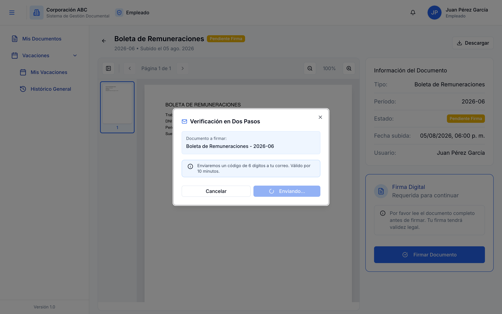

**Descripción:**
El segundo paso solicita al usuario ingresar el código de 6 dígitos recibido por correo electrónico.

**Contenido del modal:**

| Elemento                              | Descripción                       |
| ------------------------------------- | ---------------------------------- |
| **Título**                     | "Ingresa el Código"               |
| **Campo de código**            | 6 inputs numéricos independientes |
| **Email parcial**               | Muestra email oculto parcialmente  |
| **Temporizador**                | Tiempo restante (5 minutos)        |
| **Botón "Nuevo Código"**      | Solicita reenvío del código      |
| **Botón "Verificar y Firmar"** | Completa el proceso de firma       |

**Flujo:**

1. Usuario recibe código por email
2. Ingresa los 6 dígitos en el formulario
3. Sistema valida el código
4. Si es válido: documento queda firmado con timestamp
5. Si es inválido: muestra error y permite reintentar

---

## 16. Gestión de Vacaciones (Empleado)

### 16.1 Lista de Mis Vacaciones

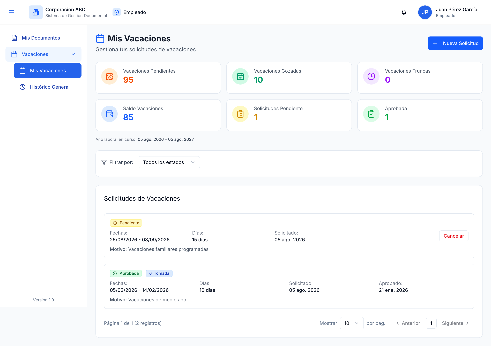

**Descripción:**
Vista que permite al empleado consultar el estado de sus solicitudes de vacaciones y crear nuevas solicitudes.

**Componentes:**

| Componente                     | Función                               |
| ------------------------------ | -------------------------------------- |
| **Encabezado**           | Título y botón "Nueva Solicitud"     |
| **Cards de métricas**   | Total, Pendientes, Aprobadas           |
| **Filtro de estado**     | Dropdown para filtrar solicitudes      |
| **Lista de solicitudes** | Tarjetas con detalle de cada solicitud |

**Información por solicitud:**

| Campo                          | Descripción                           |
| ------------------------------ | -------------------------------------- |
| **Estado**               | Badge (Pendiente, Aprobada, Rechazada) |
| **Fechas**               | Rango de inicio a fin                  |
| **Duración**            | Días totales                          |
| **Fecha de solicitud**   | Cuándo fue creada                     |
| **Fecha de aprobación** | Cuándo fue procesada                  |
| **Motivo**               | Razón opcional                        |

### 16.2 Formulario de Nueva Solicitud

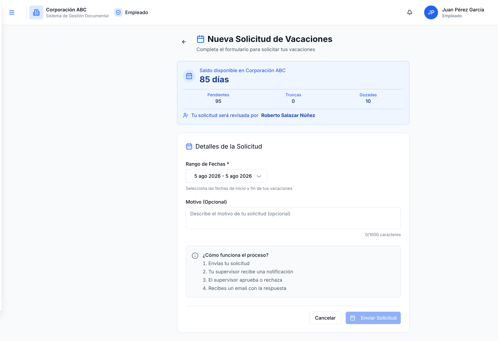

**Descripción:**
Formulario para crear una nueva solicitud de vacaciones.

**Campos del formulario:**

| Campo                     | Tipo        | Requerido | Descripción                                  |
| ------------------------- | ----------- | --------- | --------------------------------------------- |
| **Rango de Fechas** | Date picker | Sí       | Fecha inicio y fin                            |
| **Motivo**          | Textarea    | No        | Razón de la solicitud (máx 1000 caracteres) |

**Panel informativo "¿Cómo funciona?":**

1. Envío de la solicitud al sistema
2. Notificación automática al supervisor
3. Revisión y decisión del supervisor
4. Notificación por email del resultado

---

# APÉNDICES

---

## Flujos de Proceso

### Flujo 1: Firma de Documento

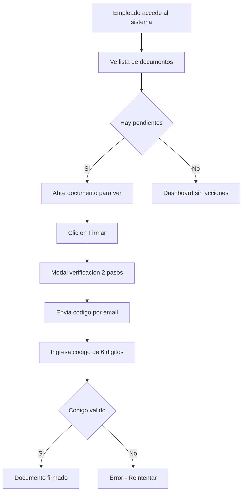
```mermaid
flowchart TD
    A[Empleado accede al sistema] --> B[Ve lista de documentos]
    B --> C{Hay pendientes}
    C -- Si --> D[Abre documento para ver]
    C -- No --> E[Dashboard sin acciones]
    D --> F[Clic en Firmar]
    F --> G[Modal verificacion 2 pasos]
    G --> H[Envia codigo por email]
    H --> I[Ingresa codigo de 6 digitos]
    I --> J{Codigo valido}
    J -- Si --> K[Documento firmado]
    J -- No --> L[Error - Reintentar]
```

### Flujo 2: Solicitud de Vacaciones

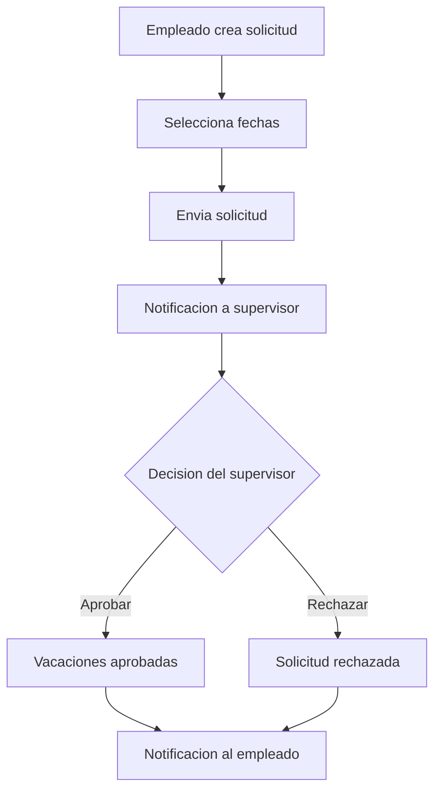
```mermaid
flowchart TD
    A[Empleado crea solicitud] --> B[Selecciona fechas]
    B --> C[Envia solicitud]
    C --> D[Notificacion a supervisor]
    D --> E{Decision del supervisor}
    E -- Aprobar --> F[Vacaciones aprobadas]
    E -- Rechazar --> G[Solicitud rechazada]
    F --> H[Notificacion al empleado]
    G --> H
```

### Flujo 3: Carga Masiva de Documentos

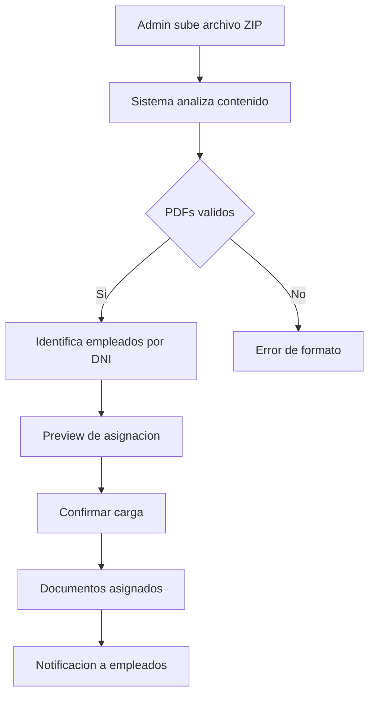
```mermaid
flowchart TD
    A[Admin sube archivo ZIP] --> B[Sistema analiza contenido]
    B --> C{PDFs validos}
    C -- Si --> D[Identifica empleados por DNI]
    C -- No --> E[Error de formato]
    D --> F[Preview de asignacion]
    F --> G[Confirmar carga]
    G --> H[Documentos asignados]
    H --> I[Notificacion a empleados]
```

### Flujo 4: Onboarding de Nueva Empresa

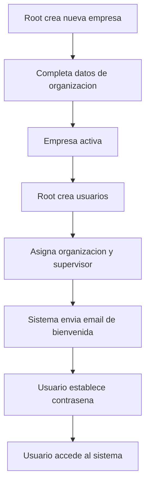
```mermaid
flowchart TD
    A[Root crea nueva empresa] --> B[Completa datos de organizacion]
    B --> C[Empresa activa]
    C --> D[Root crea usuarios]
    D --> E[Asigna organizacion y supervisor]
    E --> F[Sistema envia email de bienvenida]
    F --> G[Usuario establece contrasena]
    G --> H[Usuario accede al sistema]
```

---

## Notificaciones por Email

El sistema envía notificaciones automáticas en los siguientes eventos:

| Evento                     | Destinatario | Contenido                          |
| -------------------------- | ------------ | ---------------------------------- |
| Nuevo documento            | Empleado     | Enlace para ver y firmar           |
| Código de firma           | Empleado     | Código 6 dígitos (válido 5 min) |
| Nueva solicitud vacaciones | Supervisor   | Enlace para aprobar/rechazar       |
| Vacaciones aprobadas       | Empleado     | Confirmación con fechas           |
| Vacaciones rechazadas      | Empleado     | Razón del rechazo                 |

---

## Diseño Responsivo

El sistema está optimizado para diferentes dispositivos:

| Dispositivo       | Resolución | Características                          |
| ----------------- | ----------- | ----------------------------------------- |
| **Desktop** | ≥1024px    | Sidebar expandido, tablas completas       |
| **Tablet**  | 768-1023px  | Sidebar colapsable                        |
| **Mobile**  | <768px      | Navegación hamburguesa, cards verticales |

---

## Seguridad

### Medidas implementadas:

1. **Autenticación JWT** con tokens de corta duración
2. **Verificación en dos pasos** para firma de documentos
3. **HTTPS obligatorio** en producción
4. **Registro de auditoría** completo
5. **Control de acceso basado en roles (RBAC)**
6. **Validación de tenant** para aislamiento de datos

---

## Soporte

Para soporte técnico o consultas sobre el sistema:

- **Email:** lgranda@tisvel.com

*Documento generado automáticamente - MiBoleta v1.0.0*
*Última actualización: Enero 2026*
